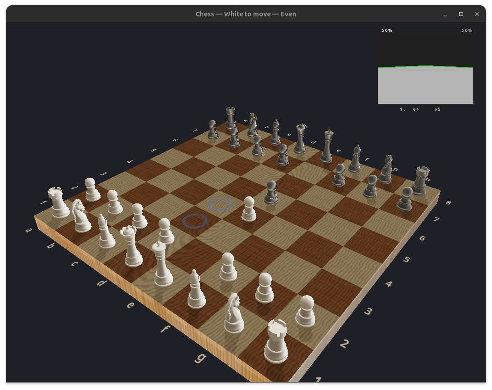
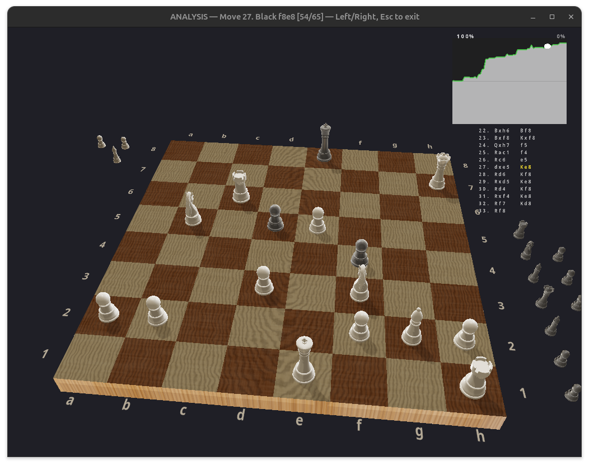

# 3D Chess

A 3D chess game in C++ that runs natively on Linux (GTK+3 + OpenGL) and in the browser (SDL2 + WebGL 2 via Emscripten). Play either side against Stockfish at any strength from 1320 to ~2850 Elo. Features PBR rendering with shadows, procedural wood textures, environment reflections, mate-in-N challenge puzzles, and an analysis mode for replaying moves. The desktop build bundles Stockfish as a git submodule; the web build vendors a prebuilt `stockfish.js` Web Worker.

  





## Features

- **3D rendered chess board** with PBR (Physically Based Rendering), shadow mapping, and procedural wood grain textures
- **AI opponent** powered by Stockfish (UCI), strength configurable from ~1320 to ~2850 Elo via an in-app slider
- **Pre-game setup screen** — choose your side (White or Black), pick Stockfish strength, and pick a time control before the game starts
- **Chess clocks**: Classical (30+30), Rapid (15+10), Blitz (5+3), Bullet (1+1), or Unlimited. Live clock shown in the top-centre during play; game ends on flag fall with a "wins on time" result. Stockfish's own move time adapts to its remaining clock
- **Full chess rules**: legal move validation, check/checkmate/stalemate detection, castling, en passant, pawn promotion
- **Interactive controls**: click to select pieces, valid moves shown as animated glowing rings
- **Animated AI moves** with blue arrow indicator and smooth piece sliding
- **Score graph** (upper-right) backed by real Stockfish centipawn evaluations, tracking advantage over time; flips orientation when you play Black so your colour is always at the bottom
- **Move list** (upper-right, below the graph) in algebraic notation with check/mate suffixes, highlighting the move currently visible in analysis mode
- **Analysis mode**: step through the game move-by-move with left/right arrows (keyboard `A` to enter). "Continue Playing" and "Back to Menu" buttons in the overlay for mouse users
- **Withdraw flag**: a small wavy white cloth flag on a brown stick in the bottom-right corner. Click it to open a confirmation dialog and surrender to the main menu. Uses a 14×9 verlet cloth simulation with normal-based half-Lambert lighting (inspired by [shadertoy MldXWX](https://www.shadertoy.com/view/MldXWX))
- **Mate-in-N challenge puzzles** loaded from `challenges/*.md`, with a glass-shatter transition between puzzles and a summary page at the end. Wrong-line attempts trigger a "Mistake!" sound + board shake + Try Again button that resets the puzzle
- **Find-all-forks / Pin-to-win** tactic puzzles cap each exercise at three candidates (or fewer if the position has fewer legal motif moves) — find any three to solve. Already-banked candidates are filtered out of the move dots so the user can't waste clicks on a fork they've already found, and wrong (or repeated) attempts fire the shake + Try-Again flow but **keep** the banked correct moves. The end-of-challenge summary lists every fork/pin found grouped by exercise number
- **Captured pieces** displayed on the sides of the board
- **Board coordinates** (a-h, 1-8) rendered with anti-aliased fonts (Cairo/Pango on desktop, `stb_truetype` in the browser)
- **Interactive main menu** — grab and fling the tumbling chess pieces around; release velocity follows the cursor/finger trajectory
- **Options screen** — reached from the main menu **Options** button; currently toggles the cartoon-outline post-process used during gameplay (also bindable to the **S** key while playing)
- **Voice move input** (desktop only) — hold **SPACE** during your turn and speak a move ("knight d3", "e4", "castle kingside"). Release to transcribe and play. Powered by an on-device [whisper.cpp](https://github.com/ggerganov/whisper.cpp) build of [distil-small.en](https://huggingface.co/distil-whisper/distil-small.en) (~166 MB). The first press lazily loads the model; if no model file is present the status bar shows a hint to run `make fetch-whisper-model`. CPU inference works out of the box; opt-in CUDA/Metal/Vulkan acceleration via `make WHISPER_BACKEND=cuda` (etc.)

## Dependencies

### Ubuntu / Debian

```bash
sudo apt-get install -y \
    build-essential \
    libgtk-3-dev \
    libepoxy-dev \
    pkg-config
```

### Fedora

```bash
sudo dnf install -y \
    gcc-c++ make \
    gtk3-devel \
    libepoxy-devel \
    pkg-config
```

### Arch Linux

```bash
sudo pacman -S \
    base-devel \
    gtk3 \
    libepoxy \
    pkgconf
```

### macOS

Install the dependencies via [Homebrew](https://brew.sh):

```bash
brew install gtk+3 libepoxy pkg-config
```

The Makefile auto-detects Darwin and prepends Homebrew's pkgconfig directory
(both Apple Silicon `/opt/homebrew` and Intel `/usr/local` are handled via
`brew --prefix`).

> **Heads-up:** GTK3 on macOS uses a Quartz backend (no XQuartz needed) and
> compiles cleanly with the bundled Stockfish, but it is treated as a
> second-class target by upstream GTK. The renderer requests an OpenGL
> compatibility profile, while macOS only ships Core profile 3.2/4.1 — so
> while the build works, the GL rendering may need tweaks before the game
> displays correctly on a Mac. Patches welcome.

## Cloning

Clone recursively so that the Stockfish and whisper.cpp submodules are fetched:

```bash
git clone --recurse-submodules https://github.com/jaher/3d-chess
```

If you already cloned without `--recurse-submodules`, run:

```bash
git submodule update --init --recursive
```

## Building

```bash
make
```

The first build compiles Stockfish from source, downloads its NNUE network file, builds whisper.cpp via CMake, and fetches the distil-small.en GGML model (~166 MB) for voice input — together this takes a couple of minutes. Subsequent builds are incremental and the model download is skipped once the file is on disk. CMake (≥ 3.10) is required for the whisper.cpp build; on Debian/Ubuntu install it with `sudo apt-get install -y cmake`. To build without the model download (e.g. on CI), use `make chess` (just the binary target) instead of bare `make`.

## Running

```bash
./chess
```

Optionally specify a different models directory:

```bash
./chess /path/to/stl/models
```

### Running the unit tests (optional)

Pure-logic unit tests (chess rules, FEN/UCI helpers, linear algebra, FEN parser, challenge loader, tactic detection) live in `tests/` and are built with a vendored [doctest](https://github.com/doctest/doctest) single-header. Run from the repo root:

```bash
make test
```

This builds two binaries:

- **`run_tests`** — pure-logic layer only (no GL, GTK, SDL, or Stockfish subprocess). Builds and runs in under a second.
- **`run_tests_engine`** — recompiles `ai_player.cpp` with the POSIX subprocess wrapper enabled and drives a fake UCI engine (`tests/fake_stockfish.py`) so `ask_ai_move`, `stockfish_eval`, and `ai_player_set_elo` are exercised without needing a real Stockfish build. Requires `python3` on `$PATH`.

To skip the engine binary (e.g. on CI without Python), use `make test_pure` instead.

### Tuning the AI (optional)

- `CHESS_AI_ELO` — Stockfish `UCI_Elo` value (default `1400`). The in-app pregame slider overrides this for normal play. Lower is weaker; minimum useful value is `1320`.
- `CHESS_AI_MOVETIME_MS` — forces Stockfish's per-move thinking budget in milliseconds. When unset (default) Stockfish uses either its legacy 800 ms cap in Unlimited mode, or ~1/30 of its remaining clock (clamped to `[200, 3000]` ms) when a time control is active.
- `CHESS_EVAL_MOVETIME_MS` — milliseconds spent evaluating each position for the score graph (default `150`).
- `CHESS_STOCKFISH_PATH` — path to a custom Stockfish binary. If unset, the app first looks for `./third_party/stockfish/src/stockfish`, then falls back to the `stockfish` binary on `$PATH`.

A system-installed `stockfish` (e.g. via `apt-get install stockfish`) is used automatically as a fallback if the vendored binary isn't available.

### Voice move input (desktop only)

Hold **SPACE** while it's your turn to speak a move ("knight d3", "e4",
"castle kingside"). Release to transcribe and play. The first press
lazily loads a [whisper.cpp](https://github.com/ggerganov/whisper.cpp)
build of the [distil-small.en](https://huggingface.co/distil-whisper/distil-small.en)
model (~166 MB); after that it stays warm for the session.

No setup is needed beyond `make` — the default build target depends on
`third_party/whisper-models/ggml-distil-small.en.bin` and `curl`s it
into place on first run. The download is skipped on every subsequent
build. The model directory is gitignored. If the file is ever
deleted, the next `make` redownloads it; you can also force a
re-fetch with `make fetch-whisper-model`. Without the file, the first
SPACE press at runtime shows a hint in the title bar and is otherwise
a no-op.

The parser is permissive: homophones like "night d3" → knight d3 and
"right a1" → rook a1 are normalised, spelled digits ("e four") work,
and castling accepts "castle kingside / queenside", "short / long
castle", and "o-o / o-o-o". Ambiguous moves (two knights that can both
reach the destination) surface a status-bar disambiguation hint —
prefix the file letter, e.g. "b knight d3".

#### Continuous (hands-free) mode

Open the **Options** screen from the main menu and click the
**Continuous voice** row to flip it on. Once enabled, the mic stays
open and a background VAD thread watches for speech: say a move,
pause briefly, and the move plays — no key needed. Click the toggle
again to turn it back off (it's session-only, off by default on
launch). While continuous mode is on, SPACE is suppressed with a
status-bar hint so the two modes never race for the same mic.

#### Voice UI commands

In addition to chess moves, the same speech engine recognises spoken
button labels for the screen you're on. Examples:

- **Main menu**: "play", "challenges", "options"
- **Pregame**: "start", "white", "black", "back"
- **Options**: "back", "cartoon outline", "continuous voice", "verbose log" (BLE diagnostic)
- **Live game**: "resign" / "withdraw" (opens the same confirmation as
  clicking the white flag)
- **Resign confirmation modal**: "yes" / "no" — modal eats every other
  utterance until you decide
- **Chessnut Move toggle (in Options)**: "chessnut" / "robot board"
- **Game over / analysis**: "back to menu", "continue playing", "new game"
- **Challenge solved**: "next", "next puzzle"
- **Challenge mistake**: "try again", "retry"
- **Challenge summary**: "back", "done"

Recognition is mode-aware: each phrase only matches when the
corresponding button is on screen. Chess moves and UI commands
share the parser — say "knight d3" to move, "back to menu" to leave
the game.

The `whisper_input.cpp` parser is pure C++ and exercised by
`tests/voice_input_test.cpp`. SDL2 capture and whisper.cpp inference
live in `voice_whisper.cpp` and are excluded from the test binary so
the unit tests stay self-contained.

#### Optional: GPU acceleration

CPU is the default and is fast enough for the chess-move vocabulary.
If you want GPU acceleration, opt in at build time via
`WHISPER_BACKEND`:

```bash
make WHISPER_BACKEND=cuda      # NVIDIA — needs nvcc on $PATH
make WHISPER_BACKEND=metal     # macOS Metal (default on Darwin)
make WHISPER_BACKEND=vulkan    # Vulkan (Linux/Windows GPUs)
make WHISPER_BACKEND=auto      # detect: CUDA on Linux if nvcc present, Metal on macOS, else CPU
make WHISPER_BACKEND=cpu       # explicit CPU (the default on Linux)
```

#### macOS microphone permission

SDL2's audio capture relies on the standard macOS Core Audio API, so
the first run will prompt for microphone permission. If you've packaged
the binary into a `.app`, the bundle's `Info.plist` needs an
`NSMicrophoneUsageDescription` entry; running the raw `./chess` binary
from a terminal works without one but still has to be granted
permission once.

#### Web build

The browser uses a different speech engine. SPACE push-to-talk and
whisper.cpp are desktop-only — `voice_whisper.cpp` is excluded from
the WebAssembly bundle, so spacebar in the browser does nothing
voice-related and there's no model to download.

Continuous mode in the browser uses the built-in `SpeechRecognition`
API instead. Toggle **Continuous voice** in Options the same way as
on desktop; the browser will prompt for mic permission on first
enable, then stream partial transcripts (visible in the status bar)
and final utterances directly to the move parser. Zero model weight,
zero startup latency, accuracy is excellent — but it requires a
browser that ships SpeechRecognition: Chrome, Edge, and Safari yes;
Firefox no (the toggle is hidden when the API isn't available).
The web pipeline relies on the browser vendor's cloud STT under the
hood, so audio leaves the device.

### Chessnut Move physical board

If you own a [Chessnut Move](https://www.chessnutech.com/) robotic
chessboard, the app can mirror every move onto the physical pieces
over Bluetooth Low Energy. Toggle **Chessnut Move** in the Options
screen (off by default). Available on **both desktop and web**. On enable the app:

1. Initialises the in-process BLE client
   ([SimpleBLE](https://github.com/OpenBluetoothToolbox/SimpleBLE)
   submodule, BlueZ on Linux / IOBluetooth on macOS / Windows
   Runtime on Windows).
2. Scans for a BLE peripheral named `Chessnut Move` and connects.
3. Sends the current FEN to the board with the firmware-replanning
   force flag — the board automatically positions every piece to
   match.
4. After every subsequent move (yours via click / voice, or
   Stockfish's), pushes the new FEN. The motors handle the motion
   planning; we just declare the target state.

#### Phantom Chessboard support (read-the-fine-print)

The same toggle / picker also accepts [Phantom
Chessboard](https://www.phantomchessboard.com/) devices — same
robotic-board category, different protocol family. The picker
matches device names containing `Chessnut`, `Phantom`, or
`GoChess`; whichever you pick, the app routes per-move events
through the matching driver via a shared `IBoardBridge` interface.
For Phantom:

- App→board: each move is encoded as an ASCII MOVE_CMD string and
  written to characteristic `7b204548-30c3-…`. The firmware's
  Play-Mode loop parses the string and drives its X/Y stepper
  motors via its `moveChessPiece` routine.
- Captures are dispatched with an `'x'` separator so the firmware
  lifts the captured piece off-square via `comerVersion3` before
  driving the moving piece into the destination.
- Notify-frame format from the board is **not yet verified**. The
  driver subscribes to all five notify-capable characteristics and
  logs each frame raw to stderr / the JS console — sensor-driven
  moves (you moving a piece on the physical board) won't reflect in
  the digital game until that format is confirmed against an HCI
  capture from a real Phantom.
- Force-syncs (game start, position load) are no-ops — Phantom has
  no setMoveBoard primitive, so reset the physical board manually
  if you reset the digital game.

#### BLE verbose-log toggle

Below the Chessnut Move row in Options is a **BLE verbose log**
toggle (off by default). Flipping it on routes every BLE notify
frame the bridge receives — UUID prefix plus the raw hex payload —
into the in-game status bar (truncated to fit). Intended for
capturing frames from boards on unverified firmware (especially
Phantom variants OTA-updated past the protocol we reverse-
engineered) without needing a terminal. Spoken phrase: "verbose
log".

See `PHANTOM.md` for the full reverse-engineering notes.

Build dependency: `libdbus-1-dev` (required by SimpleBLE on Linux).
On Debian/Ubuntu: `sudo apt-get install -y libdbus-1-dev`. The
SimpleBLE static library builds automatically on first
`make` invocation, the same way whisper.cpp does. No Python
runtime dependency in the default path.

#### Standalone Python helper

The `tools/chessnut_bridge.py` script speaks the same wire format
as the in-app driver and is useful for protocol experimentation
without launching the full game. It uses
[`bleak`](https://github.com/hbldh/bleak) (`pip install --user
bleak`) and logs every BLE notification to stdout, so it's easy
to drive by hand for one-off captures:

```bash
python3 tools/chessnut_bridge.py
INIT
FEN_FORCE rnbqkbnr/pppppppp/8/8/8/8/PPPPPPPP/RNBQKBNR w KQkq - 0 1
QUIT
```

The chess binary itself does *not* shell out to this script — it
talks to the board directly via SimpleBLE.

#### Web build (Web Bluetooth)

The browser version uses the
[Web Bluetooth API](https://developer.mozilla.org/en-US/docs/Web/API/Web_Bluetooth_API)
(`navigator.bluetooth.requestDevice`). Same wire format, same
encoder, just no SimpleBLE / no Python — the browser provides the
BLE stack. Browser support:

- **Chrome / Edge / Opera (desktop + Android)**: full support.
- **Safari (macOS / iOS)**: not supported. The toggle is hidden.
- **Firefox**: not supported. The toggle is hidden.

Two browser-specific caveats:

1. **HTTPS or localhost only.** Web Bluetooth refuses to run on
   plain HTTP — `make serve` works (localhost), but a deployed copy
   needs TLS.
2. **Permissions don't persist.** Each page reload re-prompts the
   "Choose a device" dialog. The first click on the toggle (a
   user-gesture click) opens the picker; subsequent moves write
   transparently for the rest of the session.

If a phone is paired with the board over the official app, the
browser can't open a second BLE connection — disconnect the phone
first.

The protocol details (GATT UUIDs, opcodes, piece encoding) live in
the reverse-engineering notes at [`CHESSNUT.md`](CHESSNUT.md) in
this repo — extracted from the official Android app and cross-
verified against the documented Chessnut Air community protocol. Move's wire format
is a strict superset of Air's, with one extra opcode (`0x42`) for
the motor-driven `setMoveBoard` command.

## Browser / WebAssembly version

The same game also runs in a browser, compiled to WebAssembly via
[Emscripten](https://emscripten.org). It uses **WebGL 2** for the renderer
and a vendored single-threaded build of
[Stockfish.js](https://github.com/nmrugg/stockfish.js) running inside a
Web Worker for the AI. No `SharedArrayBuffer` / COOP-COEP setup required,
so it deploys on plain GitHub Pages.

**Live demo:** <https://jaher.github.io/3d-chess/> (auto-deployed from `main`
by `.github/workflows/deploy-pages.yml`)

### Prerequisites

- A working Emscripten toolchain (`em++` on `$PATH`). On Debian/Ubuntu:
  ```bash
  sudo apt install emscripten
  ```
  Other platforms: install via the [emsdk](https://emscripten.org/docs/getting_started/downloads.html) and `source ./emsdk_env.sh`.
- Python 3 (for the local development server).

### Building

```bash
cd web
make
```

The Makefile compiles the shared C++ rendering / rules code together with
the web-only platform layer (`web/main_web.cpp`, `web/ai_player_web.cpp`,
`web/font_atlas_stb.cpp`) and produces `chess.html`, `chess.js`, `chess.wasm`,
and `chess.data` in `web/`. The first build takes 1–2 minutes; subsequent
builds are incremental.

> **Debian-package quirk:** the system Emscripten config at
> `/usr/share/emscripten/.emscripten` sets `FROZEN_CACHE = True` and stores
> the cache under `/usr/share/emscripten/cache/` which is not user-writable,
> so the SDL2 port can't be fetched on first build. Workaround: copy the
> system cache to a writable location and use a custom config:
> ```bash
> cp -r /usr/share/emscripten/cache ~/.emscripten_cache
> cat > ~/.emscripten <<'EOF'
> EMSCRIPTEN_ROOT = '/usr/share/emscripten'
> LLVM_ROOT = '/usr/bin'
> BINARYEN_ROOT = '/usr'
> NODE_JS = '/usr/bin/node'
> JAVA = 'java'
> FROZEN_CACHE = False
> CLOSURE_COMPILER = 'closure-compiler'
> LLVM_ADD_VERSION = '15'
> CLANG_ADD_VERSION = '15'
> CACHE = '/home/<your-username>/.emscripten_cache'
> EOF
> EM_CONFIG=~/.emscripten make
> ```
> Once the SDL2 port is fetched into your writable cache, subsequent
> `EM_CONFIG=~/.emscripten make` runs are fast.

### Running locally

Browsers refuse to load WebAssembly from `file://` URLs, so serve the
`web/` directory over HTTP:

```bash
cd web
make serve            # python3 -m http.server 8000
```

Then open <http://localhost:8000/chess.html>.

### Deploying to GitHub Pages

A workflow at `.github/workflows/deploy-pages.yml` handles this
automatically: every push to `main` builds the WebAssembly target on a
GitHub-hosted runner and deploys the resulting `web/` directory to Pages.

**One-time repo setup:**
1. Open **Settings → Pages**.
2. Set **Source** to **GitHub Actions**.
3. Push to `main` (or run the workflow manually from the Actions tab) —
   the first deploy takes ~3 minutes because Emscripten has to fetch
   SDL2 source on the runner.

After that, every push to `main` redeploys automatically and the site
stays at <https://YOUR-USER.github.io/REPO/>. No special HTTP headers
required — the lite single-threaded Stockfish.js build doesn't need
`SharedArrayBuffer` or COOP-COEP.

**Manual deployment (alternative):** if you'd rather host the files
yourself, the `web/` directory is fully self-contained after `make`.
Copy `chess.{html,js,wasm,data}`, `stockfish-bridge.js`, and
`stockfish/{stockfish.js,stockfish.wasm}` to any static host and serve
`chess.html` (or rename it to `index.html`).

### Decimated + packed models (`models-web/`, `models-web-packed/`)

The desktop `models/` directory holds heavily-tessellated STL pieces
(~250 MB total — fine for a native build but unworkable for a browser
asset bundle). The web build uses a two-step pipeline:

1. `tools/decimate_models.py` (Blender, quadric collapse) decimates
   `models/` → `models-web/` at ~80,000 triangles per piece —
   enough for the knight's mane and crown finials to stay crisp
   under close zoom.
2. `tools/pack_meshes.py` (Python stdlib) collapses duplicate
   vertices into an indexed mesh, drops the unused STL face normals
   (the runtime recomputes smooth normals), and gzips the result,
   producing `models-web-packed/` at ~4 MB total. The C++ loader
   sniffs the gzip magic on open, falling back to raw STL otherwise.

The web Makefile preloads `models-web-packed/` into `chess.data`;
the desktop build still reads `models/` directly.

To regenerate after editing `models/`:

```bash
blender --background --python tools/decimate_models.py  # → models-web/
python3 tools/pack_meshes.py                            # → models-web-packed/
```

(Blender 4.x or newer; Python 3.)

### Limitations vs the desktop build

- **Single-threaded Stockfish**: ~5× slower per node than threaded
  Stockfish, but at the default ELO cap (1400) that's still strong
  enough to play interesting games. In Bullet with adaptive move
  time it will occasionally lose on time against a fast human.
- **Lower-poly pieces**: the web build uses the packed 80k-tri
  meshes instead of the desktop's `models/` (~1M triangles per
  piece). Differences are invisible at normal zoom and only become
  noticeable at extreme close-ups.
- **Requires WebGL 2**: every modern browser since 2017 supports it
  (Chrome/Edge/Firefox/Safari/Opera). No fallback to WebGL 1.
- **Audio unlocks on first user gesture**: browsers suspend the Web
  Audio context until a real click/tap/keypress. The status bar
  appends "Click to enable sound" until then; the intro music picks
  up on the first interaction.

### How it differs from the desktop build

The vast majority of the game — chess rules, rendering, app/state
machine, input handling, physics, puzzles, time controls, cloth
flag, etc. — is a shared C++ layer (`chess_rules`, `board_renderer`,
the per-screen render modules (`menu_physics`, `menu_input`,
`challenge_ui`, `pregame_ui`, `shatter_transition`, `text_atlas`),
`shader`, `stl_model`, `compression`, `vec` / `mat`, `chess_types`,
`app_state`, `game_state`, `challenge`, `cloth_flag`,
`time_control`, `ai_player`) that compiles for both targets. Only
the thin platform driver differs:

1. **Platform layer** — `web/main_web.cpp` replaces `main.cpp` (SDL2 +
   `emscripten_set_main_loop` instead of GTK signals +
   `gtk_widget_add_tick_callback`). Both drivers fill in an
   `AppPlatform` hook table (see `app_state.h`) that the shared code
   calls through for time, redraws, title bar, AI dispatch — so the
   UI logic never touches GTK, SDL, Emscripten or any threading
   primitive directly.
2. **Engine** — `web/ai_player_web.cpp` posts UCI commands to a Web
   Worker via `EM_JS` instead of forking a Stockfish subprocess. The
   FEN/UCI helper functions in `ai_player.cpp` are reused via the
   `AI_PLAYER_HELPERS_ONLY` compile flag.
3. **Font atlas** — `web/font_atlas_stb.cpp` rasterises glyphs with
   `stb_truetype` from a vendored `DejaVuSans-Bold.ttf` instead of
   Cairo/Pango (which doesn't run in Emscripten).

Shaders use `#version 300 es` (matching WebGL 2) under `__EMSCRIPTEN__`
and `#version 330 core` on desktop, switched via a tiny header macro in
`shader.cpp`.

## Controls

| Control | Action |
|---------|--------|
| **Left click** | Select a piece / move to highlighted square / click UI button |
| **Left drag** | Rotate camera around the board |
| **Scroll wheel** | Zoom in/out |
| **Click withdraw flag** | Open the "Withdraw from game?" confirmation modal (bottom-right corner) |
| **Hold SPACE** (your turn, desktop only) | Push-to-talk: speak a move ("knight d3", "e4", "castle kingside"); release to play |
| **A** or **Left/Right arrow** | Enter analysis mode |
| **Left arrow** (analysis) | Step back one move |
| **Right arrow** (analysis) | Step forward one move |
| **Escape** (analysis) | Exit analysis mode and return to live game |
| **Escape** (modal / dropdown) | Close the dialog or collapse the dropdown |

## How to Play

1. From the main menu click **Start Game** to open the pre-game setup screen.
2. Pick your side (**White moves first** toggles to **Black moves first**), pick a **time control** from the dropdown (Classical, Rapid, Blitz, Bullet, or Unlimited — default is Classical 30+30), and drag the **Stockfish strength** slider to your preferred Elo (1320–2850).
3. Click **Start**. The board appears, the clock starts ticking, and the side you picked moves first.
4. Click a piece to select it — a blue pulsing ring appears around it. Valid moves are shown as **blue rings** (moves) or **red rings** (captures). Click a valid square to move your piece.
5. Stockfish responds with an animated move. The score graph in the top-right tracks the evaluation in centipawns; the move list below it records the game in algebraic notation.
6. The game ends on checkmate, stalemate, or when a clock reaches zero (if a time control is active). Click **Back to Menu** in the game-over overlay to play again.
7. Press **A** at any time to enter **analysis mode** and step through the game with the arrow keys. **Continue Playing** resumes from where you left off; **Back to Menu** ends the game.
8. If you want to resign, click the **withdraw flag** in the bottom-right corner and confirm — you'll be taken straight back to the main menu.

## Project Structure

```
3d_chess/
  # Core (platform-agnostic, compiles for both desktop and web)
  chess_types.h/cpp        -- Shared types (pieces, game state, board)
  chess_rules.h/cpp        -- Game logic (moves, check, mate, eval)
  game_state.h/cpp         -- Per-game lifecycle (reset, analysis enter/exit)
  challenge.h/cpp          -- Mate-in-N puzzle loader + FEN parser
  time_control.h/cpp       -- TimeControl enum + TIME_CONTROLS[] table
  app_state.h/cpp          -- UI state machine (modes, input dispatch,
                              tick, render orchestration) — thin per-mode
                              handlers delegate to the screens below

  # Renderer
  board_renderer.h/cpp     -- Main 3D game scene (PBR, shadows, AI arrow,
                              highlights) + HUD helpers (score graph,
                              move list, clock, flag, withdraw modal,
                              game-over overlay) + renderer_draw_menu
  render_internal.h        -- Shared GL globals + text helpers that the
                              per-screen render modules link against
  menu_physics.h/cpp       -- Menu piece tumble + sub-box OBB collision
  menu_input.h/cpp         -- Menu ray-pick + drag-to-fling gesture
  pregame_ui.h/cpp         -- Pregame screen (slider, dropdown, Start)
  challenge_ui.h/cpp       -- Challenge select / overlay / next / try-again
                              / summary table
  options_ui.h/cpp         -- Options screen (cartoon-outline toggle)
  shatter_transition.h/cpp -- Voronoi glass-break puzzle transition
  text_atlas.h/cpp         -- Font atlas (Cairo/Pango | stb_truetype) +
                              NDC glyph quad helpers
  shader.h/cpp             -- GLSL sources (GL 3.30 / GLSL ES 3.00)
  stl_model.h/cpp          -- STL / packed-IMSH loader
  compression.h/cpp        -- Gzip inflate wrapper (zlib)
  cloth_flag.h/cpp         -- Verlet cloth sim + half-Lambert shading
  vec.h/cpp                -- Vec3 / Vec4 + dot / length / normalize
  mat.h/cpp                -- Mat4 + transforms / inverse / normal matrix

  # AI
  ai_player.h/cpp          -- Stockfish UCI integration
                              (subprocess on desktop; helpers shared)

  # Voice input
  voice_input.h/cpp        -- Pure-logic voice-utterance parser
                              (homophone normalisation, castling,
                              piece+disambig+destination resolution).
                              Shared between desktop and web.
  voice_whisper.cpp        -- Desktop only: SDL2 microphone capture +
                              whisper.cpp inference glue. Runs on a
                              worker thread and posts results back
                              via a callback.
  web/voice_web.cpp        -- Web only: bridge to the browser's
                              SpeechRecognition API. Streams partials
                              and finals directly into the same parser
                              as the desktop path.

  # Chessnut Move physical-board mirroring
  chessnut_encode.h        -- Header-only wire-format header.
                              Named opcodes (OPCODE_*, CMD_*),
                              FEN → 32-byte board encoder, and the
                              setMoveBoard / LED frame builders.
                              Shared by the desktop and web drivers
                              so the wire format can't drift.
  chessnut_bridge.h        -- Desktop-only public PIMPL interface
                              for the Chessnut Move driver.
  chessnut_bridge.cpp      -- Desktop driver: SimpleBLE in-process,
                              worker thread + command queue.
  board_bridge.h           -- Abstract IBoardBridge interface
                              implemented by both Chessnut Move and
                              Phantom drivers. The shared dispatch
                              in app_state.cpp routes per-move
                              events through this interface so the
                              rest of the app doesn't have to think
                              about which protocol the connected
                              device speaks.
  phantom_encode.h         -- Pure-logic Phantom Chessboard wire-
                              format helpers (UUIDs, ASCII MOVE_CMD
                              builder). See PHANTOM.md for the
                              protocol notes.
  phantom_bridge.h         -- Desktop-only public PIMPL interface
                              for the Phantom driver.
  phantom_bridge.cpp       -- Desktop Phantom driver. Sibling of
                              chessnut_bridge.cpp; same threading
                              model, different protocol.
  tools/chessnut_bridge.py -- Standalone Python helper for
                              protocol experimentation (uses
                              `bleak`). Speaks the same wire
                              format; not used by the main binary.
  web/chessnut_web.cpp     -- Web build: bridge to the browser's
                              navigator.bluetooth API. Handles
                              both Chessnut Move and Phantom
                              devices behind one toggle (the
                              browser picker shows both name
                              prefixes; protocol is selected
                              after connect from the device's
                              advertised name).

  # Desktop driver
  main.cpp                 -- GTK+3 window, GtkGLArea, event wiring
                              (incl. SPACE push-to-talk → voice_input)

  # Assets
  third_party/stockfish/   -- Native Stockfish engine (git submodule)
  third_party/whisper.cpp/ -- whisper.cpp inference engine (git submodule, desktop only)
  third_party/whisper-models/
                           -- distil-small.en GGML weights (downloaded by
                              `make fetch-whisper-model`, gitignored)
  models/                  -- High-res STL piece models (desktop build)
  models-web/              -- Decimated STL pieces (~80k tris, intermediate)
  models-web-packed/       -- Gzipped indexed-mesh packed pieces (~4 MB total,
                              preloaded by the web build)
  sounds/                  -- WAVs (move / capture / check / mistake /
                              glass-break / intro music)
  challenges/              -- Puzzle definition files
  screenshots/             -- Images used in this README

  # Tools
  tools/decimate_models.py -- Blender: models/ → models-web/
  tools/pack_meshes.py     -- Python:  models-web/ → models-web-packed/
  tools/homework_wizard.py -- GTK wizard for image → FEN puzzles (Gemini)
  tools/image_to_fen.py    -- CLI for image → FEN recognition
  tools/fen_to_images.py   -- CLI for FEN → rendered diagram PNGs

  # Tests
  tests/                   -- doctest-based unit tests (chess rules,
                              FEN/UCI, challenge loader, tactics,
                              linalg, Stockfish wrapper). Run with
                              `make test` from this dir.
    doctest.h                 vendored single-header test framework
    chess_rules_test.cpp
    ai_player_helpers_test.cpp
    challenge_test.cpp
    linalg_test.cpp
    voice_input_test.cpp      Voice-utterance parser tests (pure logic)
    engine_test.cpp           Stockfish subprocess wrapper tests
                              (driven by fake_stockfish.py)
    fake_stockfish.py         minimal UCI-speaking script used by
                              engine_test.cpp
    helpers.h                 state_from_fen() test fixture helper
    Makefile

  # CI
  .github/workflows/       -- Deploy WebAssembly build to GitHub Pages

  # Web driver
  web/                     -- WebAssembly / WebGL 2 build (Emscripten)
    main_web.cpp           --   SDL2 + emscripten_set_main_loop driver
    ai_player_web.cpp      --   JS bridge to Stockfish.js Web Worker
    font_atlas_stb.cpp     --   stb_truetype font atlas baker
    stb_truetype.h         --   vendored single-header font rasterizer
    DejaVuSans-Bold.ttf    --   vendored TTF used by the atlas
    index.html             --   HTML shell (status div + canvas +
                                 audio-unlock listeners)
    stockfish-bridge.js    --   Lazy-loaded Worker glue for Stockfish
    stockfish/             --   vendored prebuilt nmrugg/stockfish.js v18
    Makefile               --   em++ build rules (per-TU objects for -jN)
```

## Rendering

- **Cook-Torrance BRDF** with GGX distribution, Smith geometry, Fresnel-Schlick
- **Shadow mapping** (4096x4096) with 5x5 PCF soft shadows
- **Procedural environment** with studio-style lighting for reflections
- **ACES filmic tone mapping** with gamma correction
- **Procedural wood grain** using 6-octave FBM noise with medullary rays

## Upgrading Stockfish

```bash
cd third_party/stockfish && git pull origin master && cd ../..
git add third_party/stockfish
git commit -m "Bump Stockfish"
```

## License

MIT
