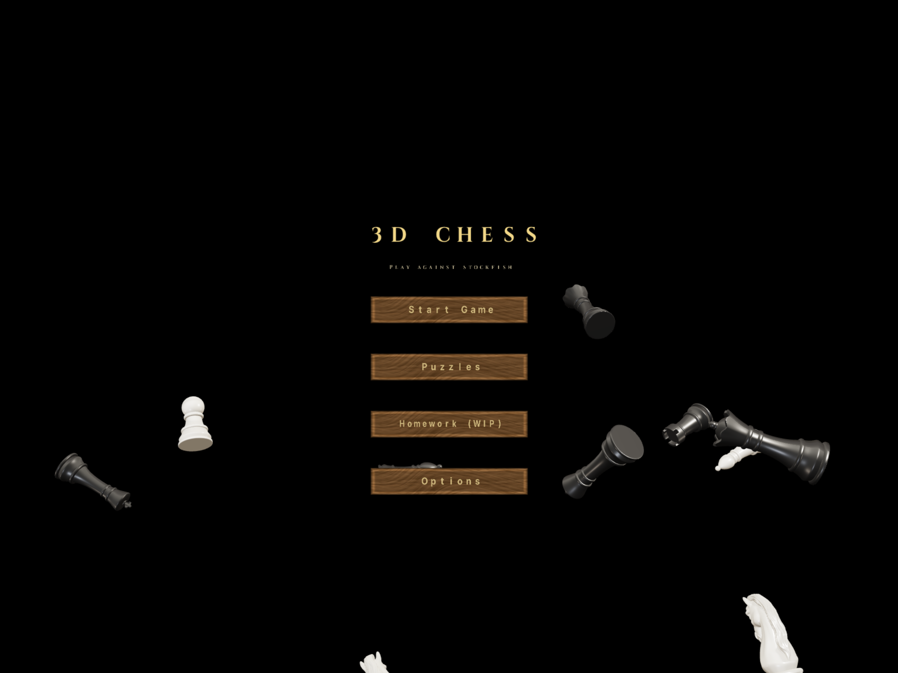
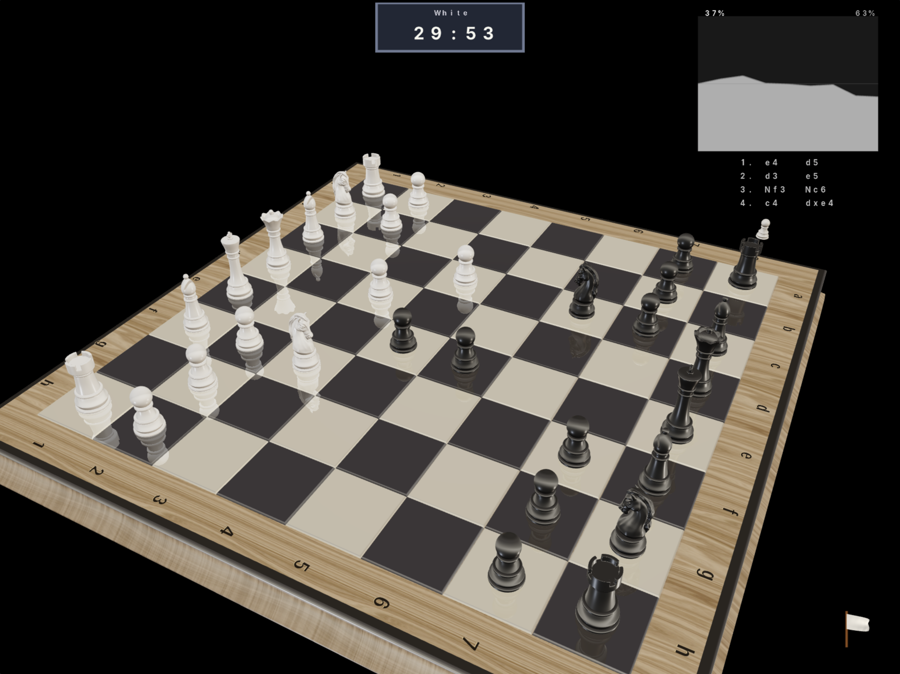

# 3D Chess — Technical Reference

Developer and platform reference for 3D Chess: the full feature matrix, every
build target (Linux GTK, native SDL2, macOS, iOS, Android, browser/WASM),
dependencies, runtime options, project layout, rendering pipeline, and engine
upkeep.

> **New here, or just want to play?** See **[README.md](README.md)** for a plain
> description of the game, quick install steps, controls, and how to play.

A 3D chess game in C++ that runs natively on Linux (GTK+3 + OpenGL) and in the browser (SDL2 + WebGL 2 via Emscripten). Play either side against Stockfish at any strength from 1320 to ~2850 Elo. Features PBR rendering with shadows, procedural wood textures, environment reflections, mate-in-N challenge puzzles, and an analysis mode for replaying moves. The desktop build bundles Stockfish as a git submodule; the web build vendors a prebuilt `stockfish.js` Web Worker.

**Play in your browser:** <https://jaher.github.io/3d-chess/>

  





## Features

- **3D rendered chess board** with PBR (Physically Based Rendering), shadow mapping, walnut wood texture (diffuse + specular maps triplanar-projected onto the frame), and lacquered glossy squares with environment reflections
- **AI opponent** powered by Stockfish (UCI), strength configurable from ~1320 to ~2850 Elo via an in-app slider
- **Pre-game setup screen** — choose your side (White or Black), pick Stockfish strength, pick a time control, and pick how many parallel games to play (1–4) before the game starts
- **Multi-game mode** — set "Games" in pregame to 2, 3, or 4 to start that many simultaneous games against Stockfish in a 2×2 grid. Play sequentially: make a move on the active board, Stockfish replies, the active board rotates to the next non-finished game. Clocks tick only on the active board; the others freeze until they come around again. Two-player and Chessnut paths force a single board
- **Online multiplayer** *(web build only)* — click **Play online** to host or join a peer-to-peer game over WebRTC. The host shares its PeerJS id as a room code; the host plays White, the joiner Black. A single peer connection carries both the game (a reliable data channel of UCI moves) and the opponent's **webcam** (a media call, shown top-left over the canvas with a small self-view bottom-left). Architecture mirrors the Stockfish bridge: `web/peer-bridge.js` exposes `window.OnlineChess` (host/join/sendMove) and calls back into WASM via the exported `chess_start_network_game` / `on_remote_move_from_js`. On the C++ side it's a thin reuse of the existing flow — `app_start_network_game` starts a normal `MODE_PLAYING` game with `network_mode` on; clicks are already gated to your side (`human_plays_white`), the local move is relayed through the `AppPlatform::trigger_send_move` hook (web-only; `nullptr` on every other driver), and the opponent's reply animates through the same path as a Stockfish move (`app_remote_move_ready` → `start_ai_animation`) with no engine call. Signalling uses the free public PeerJS broker (swap in your own PeerServer for scale); clocks are off since there's no synced timer across the connection
- **Chess clocks**: Classical (30+30), Rapid (15+10), Blitz (5+3), Bullet (1+1), or Unlimited. Live clock shown in the top-centre during play; game ends on flag fall with a "wins on time" result. Stockfish's own move time adapts to its remaining clock
- **3D analog clock model** sits alongside the right edge of the board (PBR walnut + chrome from the original Sketchfab textures). Each dial has a needle that rotates as the matching side's clock ticks — right dial = white, left = black. The needle sweeps one revolution per real-time minute (second-hand rate, chosen for visible motion on the small on-screen clock); Fischer increments show as a brief backward rotation when the side moves
- **Full chess rules**: legal move validation, check/checkmate/stalemate detection, castling, en passant, pawn promotion
- **Interactive controls**: click to select pieces, valid moves shown as animated glowing rings
- **Square-control heatmap** (press **C** in analysis/review mode — never during a live game): tints every square by which side attacks it more — blue (only White), red (only Black), purple (contested). A pure board-function teaching aid (`is_square_attacked` per square, no engine call), drawn under the pieces so it reads as board paint
- **Animated AI moves** with blue arrow indicator and smooth piece sliding
- **Score graph** (upper-right) backed by real Stockfish centipawn evaluations, tracking advantage over time; flips orientation when you play Black so your colour is always at the bottom
- **Move list** (upper-right, below the graph) in algebraic notation with check/mate suffixes, highlighting the move currently visible in analysis mode. Each move is annotated with a **move-quality badge** — a colour-coded NAG glyph (`!!` brilliant, `!` great, `?!` inaccuracy/miss, `?` mistake, `??` blunder) derived from the Stockfish evaluation swing (win-probability loss, lichess logistic), so you can see at a glance which moves changed the game. The classification is a pure, unit-tested function (`move_quality.cpp`, persisted per ply in `GameState::move_class`); the same buckets drive the spoken move-quality coach. Clicking a flagged (mistake-ish) move opens a **"why?" panel** — a translucent card naming the move's class, the engine's better **line** (`Better line:  Nf3 Nc6 Bb5` — the full principal variation, falling back to `Better was: …` for the single move when no PV is available), and a one-line board-grounded reason (e.g. "Leaves the rook on a8 hanging."). The PV is captured from Stockfish's `info … pv …` output on both the desktop subprocess (`ai_player.cpp`) and the web Stockfish.js worker (`web/stockfish-bridge.js`), threaded through `app_eval_ready` into `GameState::best_pv`, and rendered as SAN by the pure, unit-tested `pv_to_san` (`chess_rules.cpp`, which plays the UCI line out from the snapshot to name each move). Opening it rewinds the board to the position the player faced (reusing analysis mode) and **ghosts** the engine's recommended move there — a translucent cyan piece at its destination plus a cyan arrow from the origin, and (from the same `best_pv` line) a dimmer amber arrow for the opponent's expected reply, so the board shows "play this, they answer that". An "×" / Escape / clicking off closes it and returns to the live game; reopen by clicking the move again. **Post-game review** (press **R**, in-game or after game-over) jumps to your first mistake and opens its panel + ghost; ←/→ then step between mistakes ("Reviewing mistake N of M" in the status bar) — a guided walkthrough built entirely on the move classifier, the why-panel, and the ghost
- **Analysis mode**: step through the game move-by-move with left/right arrows (keyboard `A` to enter). "Continue Playing" and "Back to Menu" buttons in the overlay for mouse users
- **Withdraw flag**: a small wavy white cloth flag on a brown stick in the bottom-right corner. Click it to open a confirmation dialog and surrender to the main menu. Uses a 14×9 verlet cloth simulation with normal-based half-Lambert lighting (inspired by [shadertoy MldXWX](https://www.shadertoy.com/view/MldXWX))
- **Mate-in-N challenge puzzles** loaded from `challenges/*.md`, with a glass-shatter transition between puzzles and a summary page at the end. Wrong-line attempts trigger a "Mistake!" sound + board shake + Try Again button that resets the puzzle. Reached from the main-menu **Practice** button (formerly "Homework"). A **tactics-streak counter** rides on top of the existing solve/mistake flow: each position solved without a slip bumps the run streak (shown in amber under the puzzle info bar), any mistake resets it to zero, and the personal best (`challenge_best_streak`) is persisted across sessions — the small settings INI lives in a file under XDG config on desktop and in browser **localStorage** on web (the serialize/parse code is shared; only the storage backend differs), so progress survives a restart or page reload on either platform. The bundled `homework*.md` files (SV Chess Thinkers sets) provide the challenge content
- **Learner profile** — the same solve/mistake sites feed a lightweight per-category model (`learner_profile.h/.cpp`, pure + unit-tested): mate / fork / pin solved-vs-missed tallies plus an Elo-flavoured **tactics rating** (+20 a solve, −12 a miss, floored at 100). The Practice (challenge-select) screen surfaces a one-line summary under the title — `Tactics rating N   Weakest: <category> X%` — where the weakest area is the lowest-accuracy category with at least three attempts, plus an amber **"Drill your weakness: <category>"** button (hit-test code `-3`) that opens a matching drill file — it appears only when a dedicated drill file is installed for the weakest category. The whole profile persists to the settings INI (`learner_rating`, `learner_<cat>_solved/missed`) alongside the best streak
- **Opening trainer** — the Practice list also offers opening drills (Italian Game, Ruy Lopez, Vienna, Queen's Gambit, London, Open Sicilian) loaded from `openings/drills.md` (`name:` + `line:` UCI per block, parsed by the pure, unit-tested `openings_drills.cpp`). Selecting one (`app_enter_opening_drill`) starts a `MODE_PUZZLE` session whose solution line **is** the opening, so it rides the existing puzzle line-follower: you play your side's move, the book reply is played as a canned animation, a wrong move shakes + rewinds to the start, and finishing the line ends the drill — with `puzzle_is_opening` set so it shows "Opening learned" instead of fetching a chess.com puzzle. Every line is checked legal move-by-move at build time by `tests/openings_drills_test.cpp`
- **Chess.com puzzle of the day** — main-menu **Puzzles** button fetches the current Daily Puzzle from [api.chess.com](https://www.chess.com/news/view/published-data-api), sets up the position, and lets you play it out. The opponent uses chess.com's canonical solution as ground truth: the PGN body returned by the API is parsed into a UCI move sequence at load time, and your moves are validated against that sequence. Match the line → the AI plays the next entry directly (no Stockfish call). Diverge from the line → the board shakes and resets to the original starting FEN so you can retry from scratch. If the PGN is missing or the parser can't unambiguously match a SAN token, validation falls back off and you play freely with Stockfish picking the AI replies. The puzzle resolves only when the game ends on the board (checkmate or stalemate), at which point a fresh random puzzle loads automatically. Desktop fetches via libcurl; the web build uses `fetch()` (no auth, no API key — public read-only data). On desktop the daily puzzle is also archived to `./puzzles/<sanitised-title>_<YYYY-MM-DD>.md` the first time it's loaded each day (format mirrors `challenges/*.md`), so the collection accumulates over time. The cron fetcher (`tools/fetch_daily_puzzle.py`) hits both `/pub/puzzle` *and* `/pub/puzzle/random` per run; both responses land flat under `puzzles/`, dedup is by FEN across the directory so the same position is never stored twice. To grow the archive without launching the app, install the script as a cron job:
  ```cron
  0 */12 * * * /path/to/3d_chess/tools/fetch_daily_puzzle.py >> /tmp/fetch_daily_puzzle.log 2>&1
  ```
  The script dedups by FEN — running it more than once a day, or against a daily puzzle chess.com reposts later, won't write a duplicate file
- **Find-all-forks / Pin-to-win** tactic puzzles cap each exercise at three candidates (or fewer if the position has fewer legal motif moves) — find any three to solve. Already-banked candidates are filtered out of the move dots so the user can't waste clicks on a fork they've already found, and wrong (or repeated) attempts fire the shake + Try-Again flow but **keep** the banked correct moves. The end-of-challenge summary lists every fork/pin found grouped by exercise number
- **Captured pieces** displayed on the sides of the board
- **Board coordinates** (a-h, 1-8) rendered with anti-aliased fonts (Cairo/Pango on desktop, `stb_truetype` in the browser)
- **Interactive main menu** — grab and fling the tumbling chess pieces around; release velocity follows the cursor/finger trajectory
- **Options screen** — reached from the main menu **Options** button; toggles for voice input, TTS, move hints, the Gaussian-splat backdrop, the Chessnut Move bridge, and BLE verbose log
- **Voice move input** (desktop only) — hold **SPACE** during your turn and speak a move ("knight d3", "e4", "castle kingside"). Release to transcribe and play. Powered by an on-device [whisper.cpp](https://github.com/ggerganov/whisper.cpp) build of [distil-small.en](https://huggingface.co/distil-whisper/distil-small.en) (~166 MB). The first press lazily loads the model; if no model file is present the status bar shows a hint to run `make fetch-whisper-model`. CPU inference works out of the box; opt-in CUDA/Metal/Vulkan acceleration via `make WHISPER_BACKEND=cuda` (etc.)

## Dependencies

### Ubuntu / Debian

```bash
sudo apt-get install -y \
    build-essential \
    libgtk-3-dev \
    libepoxy-dev \
    libcurl4-openssl-dev \
    pkg-config
```

### Fedora

```bash
sudo dnf install -y \
    gcc-c++ make \
    gtk3-devel \
    libepoxy-devel \
    libcurl-devel \
    pkg-config
```

### Arch Linux

```bash
sudo pacman -S \
    base-devel \
    gtk3 \
    libepoxy \
    curl \
    pkgconf
```

### macOS

Install the dependencies via [Homebrew](https://brew.sh):

```bash
brew install gtk+3 libepoxy curl pkg-config
```

The Makefile auto-detects Darwin and prepends Homebrew's pkgconfig directory
(both Apple Silicon `/opt/homebrew` and Intel `/usr/local` are handled via
`brew --prefix`).

> **Heads-up:** GTK3 on macOS uses a Quartz backend (no XQuartz needed) and
> compiles cleanly with the bundled Stockfish, but it is treated as a
> second-class target by upstream GTK. The renderer requests an OpenGL
> compatibility profile, while macOS only ships Core profile 3.2/4.1 — so
> while the GTK build works, the GL rendering may need tweaks before the game
> displays correctly on a Mac. Patches welcome.
>
> **Native macOS build (recommended on a Mac):** instead of GTK, build the
> SDL2 driver — native windowing + OpenGL with no GTK dependency:
>
> ```bash
> brew install sdl2 libepoxy pango cairo glib fontconfig curl pkg-config
> make -f Makefile.sdl -j8        # produces ./chess_sdl
> ./chess_sdl
> ```
>
> The window toolkit (SDL2 vs GTK) has **no effect on render quality** — it's
> the same OpenGL/GLSL engine. The driver requests the highest core profile
> each OS supports: **4.3 on Linux/Windows** (compute shaders available, so
> the `gl_raster` tile rasterizer runs — pixel-identical to the GTK build,
> splat backdrop included) and **4.1 on macOS** (Apple's ceiling). macOS has
> **no compute shaders**, so only the Gaussian-splat *backdrop* falls back to
> the per-quad path (`main_sdl.cpp` sets `CHESS_GL_COMPUTE_SPLATS=0`
> automatically); the board, pieces, PBR, shadows, and 4× MSAA are identical
> to GTK. Full details, caveats, and the list of what couldn't be verified
> without Mac hardware are in [`docs/MACOS.md`](docs/MACOS.md).

### iOS / iPadOS (experimental scaffold)

There is an **experimental, not-yet-build-verified** native iOS / iPadOS
scaffold under [`ios/`](ios/) — a CMake project (`cmake -G Xcode
-DCMAKE_SYSTEM_NAME=iOS …`) that builds the shared engine against SDL2's iOS
backend with an **OpenGL ES 3.0** context, the **stb_truetype** text path, and
**two-finger pinch** touch input — architecturally the same as the web build.
It can only be built on a Mac with Xcode, so it ships as a complete scaffold to
open and finish, **not** a working app: the AI is a legal-move *placeholder*
(iOS forbids `fork`/`exec`, so the subprocess Stockfish can't run — the #1 TODO
is linking Stockfish **in-process**), and voice / Chessnut are stubbed
unsupported like the web feature-detect. The Linux GTK, web, and native SDL2
builds are unaffected (every iOS addition is additive or guarded). Full
prerequisites, exact build commands, and the "needs a Mac" TODO list are in
[`docs/IOS.md`](docs/IOS.md).

### Android (experimental scaffold)

There is a matching **experimental, not-yet-build-verified** native Android
scaffold under [`android/`](android/) — a Gradle + NDK + CMake project
(open in Android Studio or `cd android && ./gradlew assembleDebug`) that builds
the **same shared engine** against SDL2's Android backend with an **OpenGL ES
3.0** context (`<GLES3/gl3.h>`), the **stb_truetype** text path, and the
**two-finger pinch** touch input — the close sibling of the iOS scaffold. It
needs the Android SDK + NDK + Gradle (and a device/emulator), so it ships as a
complete scaffold to open and finish, **not** a working app: the AI is the same
legal-move *placeholder* (an APK can't `fork`/`exec` the subprocess Stockfish —
the #1 TODO is linking Stockfish **in-process**), and voice / Chessnut are
stubbed unsupported like the web feature-detect. Assets are bundled into the
APK and extracted to internal storage on first run. The Linux GTK, web, native
SDL2, and iOS builds are unaffected (every Android addition is additive or
guarded behind the `CHESS_GLES` / `CHESS_PLATFORM_MOBILE` macros). Full
prerequisites, exact build/install commands, how SDL2-Android is supplied
(vendored sources vs prefab AAR), the asset-extraction approach, and the "needs
Android tooling" TODO list are in [`docs/ANDROID.md`](docs/ANDROID.md).

### Meta Ray-Ban Display glasses (full Web-App chess game)

There is a **complete, playable** chess game for the **Meta Ray-Ban Display**
glasses under [`glasses/`](glasses/), **not yet run on hardware**. Unlike the
iOS/Android scaffolds it is **not** a C++ driver — Meta's only publicly available
path for rendering a fully custom UI to the Display lens is a **Web App**
(standard HTML/CSS/JS loaded from a public HTTPS URL by the Meta AI app; **no
companion app**). So `glasses/` is a standalone static Web App that renders a
glanceable 600×600 chess HUD — board, eval bar, last move + quality badge, clock,
"your move" prompt — driven entirely by the **D-pad key events** the glasses emit
(Neural Band sEMG swipes/pinches and frame cap-touch arrive as standard
`Arrow*`/`Enter`/`Escape` `keydown`). It runs in a desktop browser (arrow keys =
D-pad — Meta's own local-test loop).

The chess **rules and AI are fully implemented** (no stubs): `glasses/chess.js`
is a perft-verified legal move generator (castling, en passant, promotion,
check/mate/stalemate, draws; depth-5 perft = 4 865 609) and `glasses/engine.js`
is an alpha-beta AI run off the main thread in a Web Worker
(`glasses/engine-worker.js`). A hand-written JS engine is used rather than the
desktop/web build's Stockfish.js because the glasses run a lightweight on-device
browser. The app adds legal-move highlighting, a promotion picker, board flip for
playing Black, move-quality coaching, a clock with flagging, a settings menu,
`localStorage` resume, and a web-app `manifest.json` + PNG icons for deployment.
No Makefile compiles it, so every existing build (GTK, web, SDL2, iOS, Android)
is unaffected. The research (with official Meta SDK URLs), the rationale for the
Web-App path over a Unity/Spatial-SDK port or an Android companion app, the
staged plan, and the one `AppPlatform` hook a future phone-companion bridge would
add are in [`docs/meta-rayban-display.md`](docs/meta-rayban-display.md).

**Move sync (glasses ↔ desktop ↔ Chessnut).** The glasses Web App cannot use
Bluetooth (no Web Bluetooth in its sandbox), so it links to the desktop over a
WebSocket relay (`glasses/sync-server.js`) while the desktop joins the same room
over raw TCP (`net_sync.cpp`, wired to `AppPlatform::trigger_send_move` /
`app_remote_move_ready`). Launch the desktop with `CHESS_SYNC_ROOM=<n>` to link.
The link runs **concurrently with a paired Chessnut e-board**: a move-relay pump
at the end of `app_tick` mirrors every newly-applied move — from any input path
(glasses, board sensor, mouse, voice) — out to the glasses, while glasses moves
drive the physical board through `app_chessnut_sync_board`, so the screen, the
glasses, and the board all reflect one game.

## Cloning

Clone recursively so that the Stockfish and whisper.cpp submodules are fetched:

```bash
git clone --recurse-submodules https://github.com/jaher/3d-chess
```

If you already cloned without `--recurse-submodules`, run:

```bash
git submodule update --init --recursive
```

## Building

```bash
make
```

The first build compiles Stockfish from source, downloads its NNUE network file, builds whisper.cpp via CMake, and fetches the distil-small.en GGML model (~166 MB) for voice input — together this takes a couple of minutes. Subsequent builds are incremental and the model download is skipped once the file is on disk. CMake (≥ 3.10) is required for the whisper.cpp build; on Debian/Ubuntu install it with `sudo apt-get install -y cmake`. To build without the model download (e.g. on CI), use `make chess` (just the binary target) instead of bare `make`.

### Native SDL2 build (GTK-free)

There is a second desktop driver, `main_sdl.cpp`, that uses **SDL2 + an
OpenGL 3.3 core context** instead of GTK. It shares the entire engine and
renderer with the GTK build — only the windowing, input, main loop, and
worker-thread marshalling differ — and is the recommended path on **macOS**
(which has no first-class GTK). It also works on Linux/Windows as a GTK-free
alternative.

```bash
make -f Makefile.sdl -j20      # produces ./chess_sdl
./chess_sdl
```

The SDL build is fully separate from the GTK (`make chess`) and web
(`make -C web`) targets — it compiles into `obj-sdl/` so none of their object
files or flags are touched. On macOS it needs a few extra Homebrew kegs; see
[`docs/MACOS.md`](docs/MACOS.md). Because macOS OpenGL has no compute shaders,
the SDL driver forces the per-quad Gaussian-splat path
(`CHESS_GL_COMPUTE_SPLATS=0`); on Linux you can still export
`CHESS_GL_COMPUTE_SPLATS=1` to exercise the GL-compute tile rasterizer.

## Running

```bash
./chess
```

Optionally specify a different models directory:

```bash
./chess /path/to/stl/models
```

### Running the unit tests (optional)

Pure-logic unit tests (chess rules, FEN/UCI helpers, linear algebra, FEN parser, challenge loader, tactic detection, asset-loading tiers) live in `tests/` and are built with a vendored [doctest](https://github.com/doctest/doctest) single-header. Run from the repo root:

```bash
make test
```

This builds two binaries:

- **`run_tests`** — pure-logic layer only (no GL, GTK, SDL, or Stockfish subprocess). Builds and runs in under a second.
- **`run_tests_engine`** — recompiles `ai_player.cpp` with the POSIX subprocess wrapper enabled and drives a fake UCI engine (`tests/fake_stockfish.py`) so `ask_ai_move`, `stockfish_eval`, and `ai_player_set_elo` are exercised without needing a real Stockfish build. Requires `python3` on `$PATH`.

To skip the engine binary (e.g. on CI without Python), use `make test_pure` instead.

### Tuning the AI (optional)

- `CHESS_AI_ELO` — Stockfish `UCI_Elo` value (default `1400`). The in-app pregame slider overrides this for normal play. Lower is weaker; minimum useful value is `1320`.
- `CHESS_AI_MOVETIME_MS` — forces Stockfish's per-move thinking budget in milliseconds. When unset (default) Stockfish uses either its legacy 800 ms cap in Unlimited mode, or ~1/30 of its remaining clock (clamped to `[200, 3000]` ms) when a time control is active.
- `CHESS_EVAL_MOVETIME_MS` — milliseconds spent evaluating each position for the score graph (default `150`).
- `CHESS_STOCKFISH_PATH` — path to a custom Stockfish binary. If unset, the app first looks for `./third_party/stockfish/src/stockfish`, then falls back to the `stockfish` binary on `$PATH`.

A system-installed `stockfish` (e.g. via `apt-get install stockfish`) is used automatically as a fallback if the vendored binary isn't available.

### Voice move input (desktop only)

Hold **SPACE** while it's your turn to speak a move ("knight d3", "e4",
"castle kingside"). Release to transcribe and play. The first press
lazily loads a [whisper.cpp](https://github.com/ggerganov/whisper.cpp)
build of the [distil-small.en](https://huggingface.co/distil-whisper/distil-small.en)
model (~166 MB); after that it stays warm for the session.

No setup is needed beyond `make` — the default build target depends on
`third_party/whisper-models/ggml-distil-small.en.bin` and `curl`s it
into place on first run. The download is skipped on every subsequent
build. The model directory is gitignored. If the file is ever
deleted, the next `make` redownloads it; you can also force a
re-fetch with `make fetch-whisper-model`. Without the file, the first
SPACE press at runtime shows a hint in the title bar and is otherwise
a no-op.

The parser is permissive: homophones like "night d3" → knight d3 and
"right a1" → rook a1 are normalised, spelled digits ("e four") work,
and castling accepts "castle kingside / queenside", "short / long
castle", and "o-o / o-o-o". Ambiguous moves (two knights that can both
reach the destination) surface a status-bar disambiguation hint —
prefix the file letter, e.g. "b knight d3".

#### Continuous (hands-free) mode

Open the **Options** screen from the main menu and click the
**Continuous voice** row to flip it on. Once enabled, the mic stays
open and a background VAD thread watches for speech: say a move,
pause briefly, and the move plays — no key needed. Click the toggle
again to turn it back off (it's session-only, off by default on
launch). While continuous mode is on, SPACE is suppressed with a
status-bar hint so the two modes never race for the same mic.

#### Speak moves (TTS announcements)

Below the voice toggles is a **Speak moves** row, **on by default**.
Every move — yours and the opponent's — is announced through the
speakers ("Knight to f three", "Pawn takes d five", "Castles
kingside, check"). Flip the toggle off in Options if you'd rather
play silently.

The same toggle drives a brief **move-quality classification**
spoken right after each move announcement, derived from the
centipawn delta between the eval before and after the move:

| Spoken phrase    | CP loss | Notes |
| ---------------- | ------: | ----- |
| Best move        |     ≤10 | Exact match for Stockfish's bestmove |
| Excellent move   |     ≤15 | Within a sliver of best |
| Good move        |     ≤50 | Solid, doesn't move the eval much |
| *(silent)*       |    ≤100 | Inaccuracy band — move text only, no label |
| Mistake          |    ≤200 | Noticeable advantage given up |
| Blunder          |    >200 | Massive eval swing |

Suppressed when the position is in mate-search territory
(scores pegged at ±100 pawn units) — the centipawn delta is
dominated by mate-distance noise there, so the classification
isn't meaningful. Brilliant / Great / Missed-win / Book-move
classifications aren't computed (they need sacrifice detection,
opening-database lookup, etc.) and may show up in a follow-up.

For your own mistake-ish moves the coach goes a step further and
**speaks the reason** right after the verdict — the same
board-grounded one-liner the "why?" panel shows ("Blunder.
Leaves the rook on a8 hanging."). It reuses
`generate_why_reason` (the unit-tested `move_reason.cpp`
function) via the per-move `why_reason` cache, so the spoken
explanation and the panel never drift. It then names what to play
instead — "…Better was Knight to f3" — from the same per-ply
`best_move` + snapshot the "why?" panel renders, via
`uci_to_speech`. Quiet and positive moves carry no reason, so they
stay a single short phrase.

Native build: powered by [Piper](https://github.com/rhasspy/piper)
neural-TTS. The Makefile fetches the prebuilt linux x86_64 binary
(~26 MB tarball, ONNX runtime bundled in) and a single voice
model (`en_US-amy-medium.onnx`, ~63 MB) from the canonical Piper
release + Hugging Face URLs on first build, into
`third_party/piper-bin/` and `third_party/piper-models/`
(both `.gitignore`'d). Per-utterance flow shells out to the
binary like the Stockfish subprocess does — text in on stdin,
raw S16 22050 Hz PCM out on stdout, fed straight into the existing
audio.cpp 8-voice mixer. Sounds nearly identical to web's
speechSynthesis. Web build: uses the browser's built-in
`window.speechSynthesis` API — no model download, voice quality
follows the platform's installed TTS engine.

Spoken phrase to flip the toggle from voice: "speak moves" /
"announce moves" / "toggle voice output".

#### Move hints (coach mode)

The next Options row, **Move hints**, is a tri-state cycle:

- **OFF** (default) — no rings, no spoken hints.
- **AUTO** — every time it's your turn, Stockfish's recommended
  move surfaces automatically: yellow rings on the from + to
  squares plus a TTS announcement ("Hint: Knight to f three").
- **ON DEMAND** — silent until you ask. Click the toggle once
  more to reach this mode; then say "give me a hint" (or
  "hint" / "best move"). The cached bestmove from the most
  recent eval surfaces with yellow rings, the move is announced,
  and the app follows up with **"Do you want to play this?"** —
  say **"yes"** to play it, **"no"** to dismiss the rings.

Click the row to cycle Off → Auto → On Demand → Off. Voice
phrases:

- Cycle the mode: "move hints" / "hint mode" / "cycle hints" /
  "coach mode" (Options screen only).
- Request a hint (On Demand mode): "give me a hint" / "hint" /
  "best move" / "what should I play" (live game only).

Hints piggyback on the score-graph's existing eval pipeline — no
extra Stockfish queries, the bestmove is already in every eval
response — so they appear within ~150 ms after your opponent
moves, with zero engine-load cost. Single-player games vs
Stockfish only; ignored in two-player mode and during challenges.

#### Voice UI commands

In addition to chess moves, the same speech engine recognises spoken
button labels for the screen you're on. Examples:

- **Main menu**: "play", "puzzles" (or "puzzle of the day"), "practice" (or "challenges" / "homework" / "tactics"), "options"
- **Pregame**: "start", "white", "black", "back"
- **Options**: "back", "continuous voice", "speak moves" (TTS announcements), "move hints" / "hint mode" (cycles Off → Auto → On Demand), "gaussian splats" / "splats" / "marble room", "robotic board" / "robot board" (connect to a Chessnut Move or Phantom Chessboard over BLE), "verbose log" (BLE diagnostic)
- **Live game (Move hints On Demand)**: "give me a hint", "hint", "best move", "what should I play"
- **Live game**: "resign" / "withdraw" (opens the same confirmation as
  clicking the white flag)
- **Resign confirmation modal**: "yes" / "no" — modal eats every other
  utterance until you decide
- **Robotic-board toggle (in Options)**: "robotic board" / "robot board" / "chessnut" / "phantom" — same toggle drives both Chessnut Move and Phantom Chessboard; the picker shows both families in one list
- **Game over / analysis**: "back to menu", "continue playing", "new game"
- **Challenge solved**: "next", "next puzzle"
- **Challenge mistake**: "try again", "retry"
- **Challenge summary**: "back", "done"

Recognition is mode-aware: each phrase only matches when the
corresponding button is on screen. Chess moves and UI commands
share the parser — say "knight d3" to move, "back to menu" to leave
the game.

The `whisper_input.cpp` parser is pure C++ and exercised by
`tests/voice_input_test.cpp`. SDL2 capture and whisper.cpp inference
live in `voice_whisper.cpp` and are excluded from the test binary so
the unit tests stay self-contained.

#### Optional: GPU acceleration

CPU is the default and is fast enough for the chess-move vocabulary.
If you want GPU acceleration, opt in at build time via
`WHISPER_BACKEND`:

```bash
make WHISPER_BACKEND=cuda      # NVIDIA — needs nvcc on $PATH
make WHISPER_BACKEND=metal     # macOS Metal (default on Darwin)
make WHISPER_BACKEND=vulkan    # Vulkan (Linux/Windows GPUs)
make WHISPER_BACKEND=auto      # detect: CUDA on Linux if nvcc present, Metal on macOS, else CPU
make WHISPER_BACKEND=cpu       # explicit CPU (the default on Linux)
```

#### macOS microphone permission

SDL2's audio capture relies on the standard macOS Core Audio API, so
the first run will prompt for microphone permission. If you've packaged
the binary into a `.app`, the bundle's `Info.plist` needs an
`NSMicrophoneUsageDescription` entry; running the raw `./chess` binary
from a terminal works without one but still has to be granted
permission once.

#### Web build

The browser uses a different speech engine. SPACE push-to-talk and
whisper.cpp are desktop-only — `voice_whisper.cpp` is excluded from
the WebAssembly bundle, so spacebar in the browser does nothing
voice-related and there's no model to download.

Continuous mode in the browser uses the built-in `SpeechRecognition`
API instead. Toggle **Continuous voice** in Options the same way as
on desktop; the browser will prompt for mic permission on first
enable, then stream partial transcripts (visible in the status bar)
and final utterances directly to the move parser. Zero model weight,
zero startup latency, accuracy is excellent — but it requires a
browser that ships SpeechRecognition: Chrome, Edge, and Safari yes;
Firefox no (the toggle is hidden when the API isn't available).
The web pipeline relies on the browser vendor's cloud STT under the
hood, so audio leaves the device.

### Chessnut Move physical board

If you own a [Chessnut Move](https://www.chessnutech.com/) robotic
chessboard, the app can mirror every move onto the physical pieces
over Bluetooth Low Energy. Toggle **Chessnut Move** in the Options
screen (off by default). Available on **both desktop and web**. On enable the app:

1. Initialises the in-process BLE client
   ([SimpleBLE](https://github.com/OpenBluetoothToolbox/SimpleBLE)
   submodule, BlueZ on Linux / IOBluetooth on macOS / Windows
   Runtime on Windows).
2. Scans for a BLE peripheral named `Chessnut Move` and connects.
3. Sends the current FEN to the board with the firmware-replanning
   force flag — the board automatically positions every piece to
   match.
4. After every subsequent move (yours via click / voice, or
   Stockfish's), pushes the new FEN. The motors handle the motion
   planning; we just declare the target state.

#### Phantom Chessboard support (read-the-fine-print)

The same toggle / picker also accepts [Phantom
Chessboard](https://www.phantomchessboard.com/) devices — same
robotic-board category, different protocol family. The picker
matches device names containing `Chessnut`, `Phantom`, or
`GoChess`; whichever you pick, the app routes per-move events
through the matching driver via a shared `IBoardBridge` interface.
For Phantom:

- App→board: each move is encoded as an ASCII MOVE_CMD string and
  written to characteristic `7b204548-30c3-…`. The firmware's
  Play-Mode loop parses the string and drives its X/Y stepper
  motors via its `moveChessPiece` routine.
- Captures are dispatched with an `'x'` separator so the firmware
  lifts the captured piece off-square via `comerVersion3` before
  driving the moving piece into the destination.
- Notify-frame format from the board is **not yet verified**. The
  driver subscribes to all five notify-capable characteristics and
  logs each frame raw to stderr / the JS console — sensor-driven
  moves (you moving a piece on the physical board) won't reflect in
  the digital game until that format is confirmed against an HCI
  capture from a real Phantom.
- Force-syncs (game start, position load) are no-ops — Phantom has
  no setMoveBoard primitive, so reset the physical board manually
  if you reset the digital game.

#### BLE verbose-log toggle

Below the Chessnut Move row in Options is a **BLE verbose log**
toggle (off by default). Flipping it on routes every BLE notify
frame the bridge receives — UUID prefix plus the raw hex payload —
into the in-game status bar (truncated to fit). Intended for
capturing frames from boards on unverified firmware (especially
Phantom variants OTA-updated past the protocol we reverse-
engineered) without needing a terminal. Spoken phrase: "verbose
log".

See [`docs/PHANTOM.md`](docs/PHANTOM.md) for the full
reverse-engineering notes and [`docs/PHANTOM_RE_FOLLOWUP.md`](docs/PHANTOM_RE_FOLLOWUP.md)
for the prioritised list of next steps.

Build dependency: `libdbus-1-dev` (required by SimpleBLE on Linux).
On Debian/Ubuntu: `sudo apt-get install -y libdbus-1-dev`. The
SimpleBLE static library builds automatically on first
`make` invocation, the same way whisper.cpp does. No Python
runtime dependency in the default path.

#### Standalone Python helper

The `tools/chessnut_bridge.py` script speaks the same wire format
as the in-app driver and is useful for protocol experimentation
without launching the full game. It uses
[`bleak`](https://github.com/hbldh/bleak) (`pip install --user
bleak`) and logs every BLE notification to stdout, so it's easy
to drive by hand for one-off captures:

```bash
python3 tools/chessnut_bridge.py
INIT
FEN_FORCE rnbqkbnr/pppppppp/8/8/8/8/PPPPPPPP/RNBQKBNR w KQkq - 0 1
QUIT
```

The chess binary itself does *not* shell out to this script — it
talks to the board directly via SimpleBLE.

#### Web build (Web Bluetooth)

The browser version uses the
[Web Bluetooth API](https://developer.mozilla.org/en-US/docs/Web/API/Web_Bluetooth_API)
(`navigator.bluetooth.requestDevice`). Same wire format, same
encoder, just no SimpleBLE / no Python — the browser provides the
BLE stack. Browser support:

- **Chrome / Edge / Opera (desktop + Android)**: full support.
- **Safari (macOS / iOS)**: not supported. The toggle is hidden.
- **Firefox**: not supported. The toggle is hidden.

Two browser-specific caveats:

1. **HTTPS or localhost only.** Web Bluetooth refuses to run on
   plain HTTP — `make serve` works (localhost), but a deployed copy
   needs TLS.
2. **Permissions don't persist.** Each page reload re-prompts the
   "Choose a device" dialog. The first click on the toggle (a
   user-gesture click) opens the picker; subsequent moves write
   transparently for the rest of the session.

If a phone is paired with the board over the official app, the
browser can't open a second BLE connection — disconnect the phone
first.

The protocol details (GATT UUIDs, opcodes, piece encoding) live in
the reverse-engineering notes at [`docs/CHESSNUT.md`](docs/CHESSNUT.md) in
this repo — extracted from the official Android app and cross-
verified against the documented Chessnut Air community protocol. Move's wire format
is a strict superset of Air's, with one extra opcode (`0x42`) for
the motor-driven `setMoveBoard` command.

## Browser / WebAssembly version

The same game also runs in a browser, compiled to WebAssembly via
[Emscripten](https://emscripten.org). It uses **WebGL 2** for the renderer
and a vendored single-threaded build of
[Stockfish.js](https://github.com/nmrugg/stockfish.js) running inside a
Web Worker for the AI. No `SharedArrayBuffer` / COOP-COEP setup required,
so it deploys on plain GitHub Pages.

**Live demo:** <https://jaher.github.io/3d-chess/> (auto-deployed from `main`
by `.github/workflows/deploy-pages.yml`)

### Prerequisites

- A working Emscripten toolchain (`em++` on `$PATH`). On Debian/Ubuntu:
  ```bash
  sudo apt install emscripten
  ```
  Other platforms: install via the [emsdk](https://emscripten.org/docs/getting_started/downloads.html) and `source ./emsdk_env.sh`.
- Python 3 (for the local development server).

### Building

```bash
cd web
make
```

The Makefile compiles the shared C++ rendering / rules code together with
the web-only platform layer (`web/main_web.cpp`, `web/ai_player_web.cpp`,
`web/font_atlas_stb.cpp`, `web/asset_loader_web.cpp`) and produces
`chess.html`, `chess.js`, `chess.wasm` and `chess.data` in `web/`, plus the
background asset packages under `web/assets/` (see
[Priority-tiered assets](#priority-tiered-assets) below). The first build
takes 1–2 minutes; subsequent builds are incremental.

> **Debian-package quirk:** the system Emscripten config at
> `/usr/share/emscripten/.emscripten` sets `FROZEN_CACHE = True` and stores
> the cache under `/usr/share/emscripten/cache/` which is not user-writable,
> so the SDL2 port can't be fetched on first build. Workaround: copy the
> system cache to a writable location and use a custom config:
> ```bash
> cp -r /usr/share/emscripten/cache ~/.emscripten_cache
> cat > ~/.emscripten <<'EOF'
> EMSCRIPTEN_ROOT = '/usr/share/emscripten'
> LLVM_ROOT = '/usr/bin'
> BINARYEN_ROOT = '/usr'
> NODE_JS = '/usr/bin/node'
> JAVA = 'java'
> FROZEN_CACHE = False
> CLOSURE_COMPILER = 'closure-compiler'
> LLVM_ADD_VERSION = '15'
> CLANG_ADD_VERSION = '15'
> CACHE = '/home/<your-username>/.emscripten_cache'
> EOF
> EM_CONFIG=~/.emscripten make
> ```
> Once the SDL2 port is fetched into your writable cache, subsequent
> `EM_CONFIG=~/.emscripten make` runs are fast.

### Running locally

Browsers refuse to load WebAssembly from `file://` URLs, so serve the
`web/` directory over HTTP:

```bash
cd web
make serve            # python3 -m http.server 8000
```

Then open <http://localhost:8000/chess.html>.

### Deploying to GitHub Pages

A workflow at `.github/workflows/deploy-pages.yml` handles this
automatically: every push to `main` builds the WebAssembly target on a
GitHub-hosted runner and deploys the resulting `web/` directory to Pages.

**One-time repo setup:**
1. Open **Settings → Pages**.
2. Set **Source** to **GitHub Actions**.
3. Push to `main` (or run the workflow manually from the Actions tab) —
   the first deploy takes ~3 minutes because Emscripten has to fetch
   SDL2 source on the runner.

After that, every push to `main` redeploys automatically and the site
stays at <https://YOUR-USER.github.io/REPO/>. No special HTTP headers
required — the lite single-threaded Stockfish.js build doesn't need
`SharedArrayBuffer` or COOP-COEP.

**Manual deployment (alternative):** if you'd rather host the files
yourself, the `web/` directory is fully self-contained after `make`.
Copy `chess.{html,js,wasm,data}`, `stockfish-bridge.js`, and
`stockfish/{stockfish.js,stockfish.wasm}` to any static host and serve
`chess.html` (or rename it to `index.html`).

### Decimated + packed models (`models-web/`, `models-web-packed/`)

The desktop `models/` directory holds heavily-tessellated STL pieces
(~250 MB total — fine for a native build but unworkable for a browser
asset bundle). The web build uses a two-step pipeline:

1. `tools/decimate_models.py` (Blender, quadric collapse) decimates
   `models/` → `models-web/` at ~80,000 triangles per piece —
   enough for the knight's mane and crown finials to stay crisp
   under close zoom.
2. `tools/pack_meshes.py` (Python stdlib) collapses duplicate
   vertices into an indexed mesh, drops the unused STL face normals
   (the runtime recomputes smooth normals), and gzips the result,
   producing `models-web-packed/` at ~4 MB total. The C++ loader
   sniffs the gzip magic on open, falling back to raw STL otherwise.

The web Makefile preloads only the six `models-web-packed/*.stl` piece
meshes into `chess.data`; the retro set under `models-web-packed/retro/`
ships in a background package instead (see
[Priority-tiered assets](#priority-tiered-assets)). The desktop build
still reads `models/` directly.

To regenerate after editing `models/`:

```bash
blender --background --python tools/decimate_models.py  # → models-web/
python3 tools/pack_meshes.py                            # → models-web-packed/
```

(Blender 4.x or newer; Python 3.)

### Priority-tiered assets

Emscripten downloads `--preload-file` data *before* `main()` runs, so
anything in `chess.data` delays the main menu. Shipping every asset there
meant waiting on ~99 MB — 58 MB of splat backdrops and 17 MB of retro
pieces that `renderer_draw_menu` never touches.

`chess.data` now carries only what the menu draws (~5.7 MB): the six piece
meshes, both fonts, the walnut button textures (`draw_wood_button` samples
`g_wood_diffuse_tex`, so without them the buttons come up dark), the
opening data that challenge-select reads, and the challenge files.
Everything else is a separate `file_packager --separate-metadata` package
under `web/assets/`, fetched in the background once the menu is up:

| Package | Size | Contents |
|---|---|---|
| `assets-game` | 22 MB | board, clock and table models; sound effects |
| `assets-splat-medieval` | 28 MB | environment 0 backdrop |
| `assets-splat-datacenter` | 29 MB | environment 1 backdrop |
| `assets-retro` | 16 MB | retro PC piece set (environment 1) |
| `assets-puzzles` | 0.5 MB | daily-puzzle library |

`asset_loader.{h,cpp}` (shared, GL-free, unit-tested in
`tests/asset_loader_test.cpp`) tracks per-group state and progress and
answers *which groups a given environment actually needs*.
`web/asset_loader_web.cpp` does the fetching: it parses each package's
`.js.metadata` manifest and writes the slices into MEMFS itself rather
than running the generated `.js`, whose Emscripten run-dependency
bookkeeping is a startup mechanism and can re-trigger module callbacks
after the runtime is up. Downloads run one at a time in priority order,
and the order follows the *saved* environment so the scene the player will
actually load unblocks first. The GL upload runs on the main thread and is what would otherwise make
the menu stutter — a whole group at once is far too much for one frame
(the game tier decodes ~15 textures across board/clock/table, the retro
set ~60, and the splat gunzips 28 MB into 1.9 M splats). So each group is
broken into steps and at most one step runs per frame, and the two steps
too big to fit in a frame — the retro set and the splat cloud, neither of
which the menu draws — are held back while the main menu is up and run
once the player reaches the pregame screen, where the loading panel
already covers the wait. The JS side likewise unpacks each package into
MEMFS in batches (48 files or 2 MB per tick) instead of one blocking
loop: the puzzle package alone is 1723 `FS.writeFile` calls. A group is
marked ready only after its last install step lands.

Pressing **Start** before the packages land doesn't lose the click:
`app_request_start_game()` holds on the pregame screen behind a progress
panel and `app_tick` enters the game the moment the last required package
installs. A failed download counts as settled, so a dead package degrades
the scene (STL pieces, no backdrop) instead of blocking play forever.

The desktop build is unaffected — `app_init` marks every group ready and
`renderer_init` still loads everything eagerly from local disk.

### Limitations vs the desktop build

- **Single-threaded Stockfish**: ~5× slower per node than threaded
  Stockfish, but at the default ELO cap (1400) that's still strong
  enough to play interesting games. In Bullet with adaptive move
  time it will occasionally lose on time against a fast human.
- **Lower-poly pieces**: the web build uses the packed 80k-tri
  meshes instead of the desktop's `models/` (~1M triangles per
  piece). Differences are invisible at normal zoom and only become
  noticeable at extreme close-ups.
- **Requires WebGL 2**: every modern browser since 2017 supports it
  (Chrome/Edge/Firefox/Safari/Opera). No fallback to WebGL 1.
- **Heavy assets stream in after the menu**: the board, clock, table,
  sound effects, retro piece set and splat backdrops download in the
  background (see [Priority-tiered assets](#priority-tiered-assets)), so
  for the first few seconds the menu has no music and starting a game may
  wait behind a progress panel. The desktop build has everything on disk
  up front.
- **Audio unlocks on first user gesture**: browsers suspend the Web
  Audio context until a real click/tap/keypress. The status bar
  appends "Click to enable sound" until then; the intro music picks
  up on the first interaction.

### How it differs from the desktop build

The vast majority of the game — chess rules, rendering, app/state
machine, input handling, physics, puzzles, time controls, cloth
flag, etc. — is a shared C++ layer (`chess_rules`, `board_renderer`,
the per-screen render modules (`menu_physics`, `menu_input`,
`challenge_ui`, `pregame_ui`, `shatter_transition`, `text_atlas`),
`shader`, `stl_model`, `compression`, `vec` / `mat`, `chess_types`,
`app_state`, `game_state`, `challenge`, `cloth_flag`,
`time_control`, `ai_player`) that compiles for both targets. Only
the thin platform driver differs:

1. **Platform layer** — `web/main_web.cpp` replaces `main.cpp` (SDL2 +
   `emscripten_set_main_loop` instead of GTK signals +
   `gtk_widget_add_tick_callback`). Both drivers fill in an
   `AppPlatform` hook table (see `app_state.h`) that the shared code
   calls through for time, redraws, title bar, AI dispatch — so the
   UI logic never touches GTK, SDL, Emscripten or any threading
   primitive directly.
2. **Engine** — `web/ai_player_web.cpp` posts UCI commands to a Web
   Worker via `EM_JS` instead of forking a Stockfish subprocess. The
   FEN/UCI helper functions in `ai_player.cpp` are reused via the
   `AI_PLAYER_HELPERS_ONLY` compile flag.
3. **Font atlas** — `web/font_atlas_stb.cpp` rasterises glyphs with
   `stb_truetype` from a vendored `DejaVuSans-Bold.ttf` instead of
   Cairo/Pango (which doesn't run in Emscripten).

Shaders use `#version 300 es` (matching WebGL 2) under `__EMSCRIPTEN__`
and `#version 330 core` on desktop, switched via a tiny header macro in
`shader.cpp`.

## Controls & how to play

The player-facing controls reference and the step-by-step "how to play"
walkthrough live in the user guide — see
[README.md](README.md#controls) and [How to Play](README.md#how-to-play).

## Project Structure

```
3d_chess/
  # Core (platform-agnostic, compiles for both desktop and web)
  chess_types.h/cpp        -- Shared types (pieces, game state, board)
  chess_rules.h/cpp        -- Game logic (moves, check, mate, eval)
  game_state.h/cpp         -- Per-game lifecycle (reset, analysis enter/exit)
  challenge.h/cpp          -- Mate-in-N puzzle loader + FEN parser
  time_control.h/cpp       -- TimeControl enum + TIME_CONTROLS[] table
  app_state.h/cpp          -- UI state machine (modes, input dispatch,
                              tick, render orchestration) — thin per-mode
                              handlers delegate to the screens below
  move_quality.h/cpp       -- Pure move-quality classifier: eval swing
                              (win-% loss) + a couple of board signals
                              -> a MoveClass (Book/Best/Brilliant/.../
                              Blunder). No AppState/GL deps; unit-tested
                              in tests/move_quality_test.cpp. app_eval_ready
                              feeds it per move and persists the result in
                              GameState::move_class for the list badges

  # Renderer
  board_renderer.h/cpp     -- Main 3D game scene (PBR, shadows, AI arrow,
                              highlights) + HUD helpers (score graph,
                              move list, clock, flag, withdraw modal,
                              game-over overlay) + renderer_draw_menu
  render_internal.h        -- Shared GL globals + text helpers that the
                              per-screen render modules link against
  menu_physics.h/cpp       -- Menu piece tumble + sub-box OBB collision
  menu_input.h/cpp         -- Menu ray-pick + drag-to-fling gesture
  pregame_ui.h/cpp         -- Pregame screen (slider, dropdown, Start)
  challenge_ui.h/cpp       -- Challenge select / overlay / next / try-again
                              / summary table
  options_ui.h/cpp         -- Options screen (splats / voice / TTS / hints / Chessnut toggles)
  puzzle.h/cpp             -- chess.com puzzle JSON parser (FEN/title/url)
                              extractor — networking lives in main.cpp
                              (desktop curl) / web/main_web.cpp (fetch())
  shatter_transition.h/cpp -- Voronoi glass-break puzzle transition
  text_atlas.h/cpp         -- Font atlas (Cairo/Pango | stb_truetype) +
                              NDC glyph quad helpers
  shader.h/cpp             -- GLSL sources (GL 3.30 / GLSL ES 3.00)
  stl_model.h/cpp          -- STL / packed-IMSH loader
  compression.h/cpp        -- Gzip inflate wrapper (zlib)
  cloth_flag.h/cpp         -- Verlet cloth sim + half-Lambert shading
  vec.h/cpp                -- Vec3 / Vec4 + dot / length / normalize
  mat.h/cpp                -- Mat4 + transforms / inverse / normal matrix

  # AI
  ai_player.h/cpp          -- Stockfish UCI integration
                              (subprocess on desktop; helpers shared)

  # Voice input
  voice_input.h/cpp        -- Pure-logic voice-utterance parser
                              (homophone normalisation, castling,
                              piece+disambig+destination resolution).
                              Shared between desktop and web.
  voice_whisper.cpp        -- Desktop only: SDL2 microphone capture +
                              whisper.cpp inference glue. Runs on a
                              worker thread and posts results back
                              via a callback.
  web/voice_web.cpp        -- Web only: bridge to the browser's
                              SpeechRecognition API. Streams partials
                              and finals directly into the same parser
                              as the desktop path.

  # Voice output (TTS — move announcements)
  voice_tts.h/cpp          -- Pure-logic SAN-to-spoken-English
                              helper (`uci_to_speech` /
                              `san_to_speech`). Shared between
                              desktop and web; doctest-covered in
                              tests/voice_tts_test.cpp.
  asset_loader.h/cpp       -- Priority-tiered asset bookkeeping: per-group
                              state (pending/loading/ready/failed),
                              download progress, and which groups a given
                              environment needs before a game can start.
                              GL/SDL-free so tests/asset_loader_test.cpp
                              covers the ordering + gating logic. Desktop
                              marks every group ready (assets are local);
                              the web build drives it from package fetches.
  voice_tts_native.cpp     -- Desktop only: forks the Piper
                              prebuilt binary per utterance,
                              writes text to its stdin, drains
                              raw S16 22050 Hz PCM from stdout
                              into the audio.cpp 8-voice mixer.
                              Worker-thread queue so the GTK
                              main thread never blocks on synth.
  web/voice_tts_web.cpp    -- Web only: EM_JS shim around
                              `window.speechSynthesis.speak`.

  # Chessnut Move physical-board mirroring
  chessnut_encode.h        -- Header-only wire-format header.
                              Named opcodes (OPCODE_*, CMD_*),
                              FEN → 32-byte board encoder, and the
                              setMoveBoard / LED frame builders.
                              Shared by the desktop and web drivers
                              so the wire format can't drift.
  chessnut_bridge.h        -- Desktop-only public PIMPL interface
                              for the Chessnut Move driver.
  chessnut_bridge.cpp      -- Desktop driver: SimpleBLE in-process,
                              worker thread + command queue.
  board_bridge.h           -- Abstract IBoardBridge interface
                              implemented by both Chessnut Move and
                              Phantom drivers. The shared dispatch
                              in app_state.cpp routes per-move
                              events through this interface so the
                              rest of the app doesn't have to think
                              about which protocol the connected
                              device speaks.
  phantom_encode.h         -- Pure-logic Phantom Chessboard wire-
                              format helpers (UUIDs, ASCII MOVE_CMD
                              builder). See docs/PHANTOM.md for the
                              protocol notes.
  phantom_bridge.h         -- Desktop-only public PIMPL interface
                              for the Phantom driver.
  phantom_bridge.cpp       -- Desktop Phantom driver. Sibling of
                              chessnut_bridge.cpp; same threading
                              model, different protocol.
  tools/chessnut_bridge.py -- Standalone Python helper for
                              protocol experimentation (uses
                              `bleak`). Speaks the same wire
                              format; not used by the main binary.
  web/chessnut_web.cpp     -- Web build: bridge to the browser's
                              navigator.bluetooth API. Handles
                              both Chessnut Move and Phantom
                              devices behind one toggle (the
                              browser picker shows both name
                              prefixes; protocol is selected
                              after connect from the device's
                              advertised name).

  # Desktop drivers
  main.cpp                 -- GTK+3 window, GtkGLArea, event wiring
                              (incl. SPACE push-to-talk → voice_input).
                              Default Linux driver (`make chess`).
  main_sdl.cpp             -- Native SDL2 + OpenGL 3.3 core driver, no
                              GTK. Same platform hooks as main.cpp, but
                              an explicit while-loop, an SDL_GL context,
                              and a mutex-guarded main-thread task queue
                              in place of g_idle_add. Recommended path on
                              macOS (which has no first-class GTK). Built
                              with `make -f Makefile.sdl` → `chess_sdl`.
                              See docs/MACOS.md.
  Makefile.sdl             -- Standalone build for chess_sdl (uname-S
                              branch: Linux -lGL/-lSDL2/-lepoxy, macOS
                              -framework OpenGL/Cocoa + sdl2-config).
                              Objects land in obj-sdl/ so the GTK build's
                              .o files are untouched.

  # Meta Ray-Ban Display chess Web App (full game, not hardware-tested)
  glasses/index.html       -- 600x600 HUD stage (prompt+clock, eval bar,
                              8x8 board, last move + quality badge, overlay);
                              marks the page as a Ray-Ban Display Web App.
  glasses/styles.css       -- Additive-lens theme (black = transparent;
                              light high-contrast UI, cyan focus ring).
  glasses/chess.js         -- Perft-verified legal rules engine (ChessRules):
                              move gen, castling/en passant/promotion,
                              check/mate/stalemate/draws, SAN, FEN. No DOM.
  glasses/engine.js        -- Alpha-beta AI (ChessEngine): iterative
                              deepening + quiescence over material+PST eval.
  glasses/engine-worker.js -- Web Worker: importScripts chess.js+engine.js,
                              runs the search off the main thread.
  glasses/app.js           -- HUD render, D-pad input (Arrow/Enter/Escape =
                              Neural Band), promotion picker, board flip,
                              move-quality coach, clock, menu, localStorage.
  glasses/manifest.json    -- Web-app manifest (+ icon-192/512.png) for
                              deployment. See docs/meta-rayban-display.md.

  # Assets
  third_party/stockfish/   -- Native Stockfish engine (git submodule)
  third_party/whisper.cpp/ -- whisper.cpp inference engine (git submodule, desktop only)
  third_party/whisper-models/
                           -- distil-small.en GGML weights (downloaded by
                              `make fetch-whisper-model`, gitignored)
  third_party/piper-bin/   -- Piper TTS prebuilt binary (~30 MB
                              extracted), fetched on first `make`
                              into this dir; gitignored.
  third_party/piper-models/
                           -- Piper voice model (`en_US-amy-medium.onnx`
                              + `.json` config, ~63 MB), fetched
                              on first `make`; gitignored. Pinned
                              to the v1.0.0 tag of
                              huggingface.co/rhasspy/piper-voices.
  models/                  -- High-res STL piece models (desktop build)
  models/board/            -- Chessboard meshes + walnut textures (Sketchfab
                              CC-BY model, see Credits). Loaded by both
                              desktop and web builds.
  models-web/              -- Decimated STL pieces (~80k tris, intermediate)
  models-web-packed/       -- Gzipped indexed-mesh packed pieces (~4 MB total,
                              preloaded by the web build)
  sounds/                  -- WAVs (move / capture / check / mistake /
                              glass-break / intro music)
  challenges/              -- Puzzle definition files
  openings/openings.tsv    -- Lichess chess-openings DB rebuilt to
                              "<position-fen>\t<eco>\t<name>"; loaded
                              by openings.cpp for opening-name TTS
  fonts/                   -- Bundled OFL TTFs (Cinzel-Bold.ttf for
                              menu titles, Inter-Bold.ttf for body
                              text, plus their *-OFL.txt licences)
  screenshots/             -- Images used in this README

  # Tools
  tools/decimate_models.py -- Blender: models/ → models-web/
  tools/pack_meshes.py     -- Python:  models-web/ → models-web-packed/
  tools/homework_wizard.py -- GTK wizard for image → FEN puzzles (Gemini)
  tools/image_to_fen.py    -- CLI for image → FEN recognition
  tools/fen_to_images.py   -- CLI for FEN → rendered diagram PNGs
  tools/fetch_daily_puzzle.py
                           -- Cron-friendly fetcher: pulls today's
                              chess.com Puzzle of the Day and writes
                              it to ./puzzles/ (skips if the FEN is
                              already archived). Suggested cron line:
                                 0 */12 * * * /path/to/3d_chess/tools/fetch_daily_puzzle.py
  tools/build_openings.py  -- Replays the lichess chess-openings TSVs
                              (a..e.tsv) through python-chess and
                              emits openings/openings.tsv keyed by
                              the four-field FEN of each line's final
                              position. Run only when refreshing the
                              source data (`pip install --user
                              chess`; sources fetched into /tmp).

  # Tests
  tests/                   -- doctest-based unit tests (chess rules,
                              FEN/UCI, challenge loader, tactics,
                              linalg, Stockfish wrapper). Run with
                              `make test` from this dir.
    doctest.h                 vendored single-header test framework
    chess_rules_test.cpp
    ai_player_helpers_test.cpp
    challenge_test.cpp
    linalg_test.cpp
    voice_input_test.cpp      Voice-utterance parser tests (pure logic)
    engine_test.cpp           Stockfish subprocess wrapper tests
                              (driven by fake_stockfish.py)
    fake_stockfish.py         minimal UCI-speaking script used by
                              engine_test.cpp
    helpers.h                 state_from_fen() test fixture helper
    Makefile

  # CI
  .github/workflows/       -- Deploy WebAssembly build to GitHub Pages

  # Web driver
  web/                     -- WebAssembly / WebGL 2 build (Emscripten)
    main_web.cpp           --   SDL2 + emscripten_set_main_loop driver
    ai_player_web.cpp      --   JS bridge to Stockfish.js Web Worker
    font_atlas_stb.cpp     --   stb_truetype font atlas baker
    asset_loader_web.cpp   --   Streams the background asset packages
                                 into MEMFS (manifest parse + progress),
                                 driving ../asset_loader.cpp
    assets/                --   generated: assets-*.data / .js.metadata
                                 background packages (gitignored)
    stb_truetype.h         --   vendored single-header font rasterizer
    DejaVuSans-Bold.ttf    --   vendored TTF used by the atlas
    index.html             --   HTML shell (status div + canvas +
                                 audio-unlock listeners)
    stockfish-bridge.js    --   Lazy-loaded Worker glue for Stockfish
    stockfish/             --   vendored prebuilt nmrugg/stockfish.js v18
    Makefile               --   em++ build rules (per-TU objects for -jN)
```

## Rendering

- **Cook-Torrance BRDF** with GGX distribution, Smith geometry, Fresnel-Schlick
- **Shadow mapping** (4096x4096) with 5x5 PCF soft shadows
- **Procedural environment** with studio-style lighting for reflections
- **ACES filmic tone mapping** with gamma correction
- **Procedural wood grain** using 6-octave FBM noise with medullary rays
- **Datacenter table (datacenter env)** — the wooden pedestal table is
  swapped for a Sketchfab folding table (single mesh, 2K glTF PBR set)
  that keeps its real 6-ft proportions: height scaled exactly so the
  feet land on the room floor with the top at the table plane, length
  uniform with height (±9.98), depth the one compromise (±5.3, a mild
  1.31× stretch) so the retro board slab and the capture rows — pulled
  inboard to Z₀ ±4.65 in this environment — stay on the top. Assets in
  `models/table/dc_table_*`; pipeline in `tools/convert_folding_table.py`
  (Blender-driven GLB → uvmesh + metallicRoughness channel split). It
  replaced an earlier Hunyuan3D steel workbench whose ±7-square force-fit
  stretched it 2.5× in Z (bake artifacts + distorted legs);
  `tools/convert_dc_table.py` documents that older pipeline. Medieval
  keeps the wooden table.
- **Digital chess clock (datacenter env)** — the analog clock is swapped
  for a DGT-style digital clock in the datacenter environment only,
  converted from the professionally-modelled `chessclockdigital v3.1`
  Blender asset (clean 4K PBR atlases, AO premultiplied into the
  diffuse, downsized to 2K; the maroon body is recoloured to charcoal
  black by the converter's `--body-black` saturated-red mask, keeping
  the grey rocker/buttons/LCD and printed labels): uniform-scaled to
  the analog clock's 3.0
  width, base at Y=0, centre at X=6.2 (deeper body than the analog
  clock, same ~0.65 gap to the board). Split into body (housing + LCD
  backplate + legs + front buttons) + the big top rocker bar (see-saws
  with the same lever-blend animation the analog levers use), with
  **live 7-segment LCD times** for both players drawn as flat quads on
  the 60°-reclined display band (its centre/tilt/extents are computed
  by the converter and baked in as the `CHESS_LCD_*` defaults). The
  source's baked static digits and display glass are dropped — the
  engine draws the real time. Assets in `models/clock/digital_*`;
  pipeline in `tools/convert_dgt_clock.py` (Blender-driven blend →
  uvmesh; `tools/convert_digital_clock.py` documents the earlier
  Hunyuan3D version this replaced). The medieval room keeps the analog
  clock, needles and all.
- **Gaussian-splat backdrop** — a generated SPZ world behind the board,
  selectable per environment: the default **medieval room**, or the
  **datacenter** that hosts the retro-PC piece set (both World Labs Marble
  generations; the datacenter comes from Google's official New Albany
  server-aisle photo, picked from a multi-photo Marble/Spaitial bake-off
  for staying clean at the 500k tier). Two rasterizer paths:
  - **Desktop default**: tile-based GL compute rasterizer (one
    workgroup per 16×16 tile, per-pixel front-to-back compositing —
    the Kerbl 2023 3DGS algorithm ported to GLSL compute, see
    `gl_raster/`). Crisper interior detail with less smearing in
    heavily-overlapped regions than the per-quad shader. Loads the
    full-res SPZ tier (~1.9M splats) by default — the parallel CPU
    sort (`__gnu_parallel::sort`) keeps rotation interactive on
    16-thread machines. Drop to the 500k tier with
    `CHESS_SPLAT_TIER=500k` on lower-thread or older hardware. Set
    `CHESS_GL_COMPUTE_SPLATS=0` to fall back to the per-splat-quad
    path (matches the Spark.js algorithm).
  - **Web**: uses the per-splat-quad path (WebGL2 has no compute
    shaders, so the tile rasterizer is desktop-only). The backdrop is
    cached across frames and only re-rendered when the camera moves, so
    a static view costs nothing per frame. **Both environments preload
    their full-res tier on web** (1.92M splats each, `web/Makefile`) —
    Marble's v2/sh0 files decode in under a second in wasm (measured;
    the earlier 124 MB/tens-of-seconds decode pain was a 5M-splat SH1
    file, since replaced), bringing the web backdrop close to desktop
    quality. `chess.data` is ~93 MB. `CHESS_SPLAT_TIER=500k` drops
    either platform back to the lighter tier. The desktop compute
    rasterizer remains slightly crisper than the per-quad web path at
    equal splat count.

## Upgrading Stockfish

```bash
cd third_party/stockfish && git pull origin master && cd ../..
git add third_party/stockfish
git commit -m "Bump Stockfish"
```

## Credits & third-party licenses

- The chessboard model and walnut texture maps under `models/board/`
  (`squares_light.stl`, `squares_dark.stl`, `frame.stl`,
  `walnut_diffuse.jpg`, `walnut_specular.png`) are derived from the
  CC-BY 4.0 ["Chess set"](https://sketchfab.com/3d-models/chess-set-a2664ea4fcaa4a64ad077667d9d0c7fb)
  model by [Brendan Wood](https://sketchfab.com/brendanwood872) on
  Sketchfab. The pieces were stripped, the geometry re-scaled to
  the project's coordinate system, and the squares grid was split
  by material in Blender; the diffuse + specular textures are
  unmodified.
- `third_party/stb_image.h` is Sean Barrett's public-domain image
  loader, used to decode the walnut JPEG / PNG at startup.

## License

MIT (project source). Bundled assets keep their original licenses
— see "Credits & third-party licenses" above.
